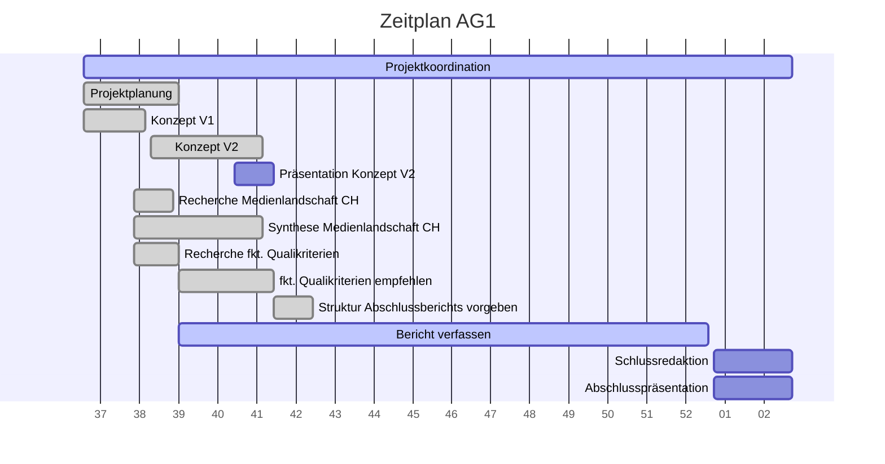

# Projektcontrolling AG 1: Projektleitung

Legende: 🟢 on time | verzögert 🟡 | kritisch 🟠 | zu spät 🔴 | erledigt: ✔️ | Milestone: 🔷
## Nächste Termine
<!-- erledigte Zeilen  hier einfügen 
| Termin | Lieferobjekt | Status |
| -------- | -------- | -------- | 
| Mo, 12.10. |Konzept V2 erstellen |&#128994;| 
|Mo, 12.10.| &#x1F537; Konzeptabgabe|✔️|
|Mi, 14.10.2020| Präsentation erstellen |🟢|
|Mi, 14.10.2020| &#x1F537; MS Präsentation gehalten |✔️|
|So, 18.10.2020 | Leistungsindikatoren in Zusammenarbeit mit AGs festlegen | &#128994; |
--> 

| Termin | Lieferobjekt | Status |
| -------- | -------- | -------- | 
|laufend | Projektcontrolling, allenfalls Massnahmen einleiten |🟢|
|31.10.20 | Zotero bereinigen, Probleme mit Sharelatex beheben |🟢|
|31.12.20 | Vergleich verschiedener Kriterienkataloge ausarbeiten |🟢|
|So, 18.10.2020 | Leistungsindikatoren in Zusammenarbeit mit AGs festlegen | &#128994; |

----
<!-- Bitte jeweils den neusten zuoberst einfügen -->
## Statusbericht vom 18. Oktober
### Lieferobjekte in Arbeit

<!-- Was zu erledigen war. Wo ihr dran seid -->
Erledigt: 
* Vorgaben Struktur Bericht
* Leistungsindikatoren Empfehlung

Sind wir dran: 
* Zotero bereinigen
* Vergleich McQuail, Arnold, Engesser
* Projektcontrolling

<!-- falls Tabellen benötigt werden
| Column 1 | Column 2 | Column 3 |
| -------- | -------- | -------- |
| Text     | Text     | Text     |

-->

## Statusbericht vom 18. Oktober
### Lieferobjekte in Arbeit

<!-- Was zu erledigen war. Wo ihr dran seid -->
* Bereinigtes Zotero
* Vergleich Kategorienkataloge
<!-- falls Tabellen benötigt werden
| Column 1 | Column 2 | Column 3 |
| -------- | -------- | -------- |
| Text     | Text     | Text     |

-->
### Entscheidungen / Abklärungen
<!-- Was war zu entscheiden / abzuklären, mit wem.  -->
Fragen zu Leistungsindikatoren und Analyseeinheiten, auf Konzepte verwiesen. 
### Herausforderungen / Besonderes
<!-- speziell Erwähnenswertes | Abhängigkeiten von anderen AGs-->
Schwierig: Abgabe Codebuch von AG2, im Auge behalten
### Ausblick / Wie geht's weiter?
<!-- Was kommt als nächstes? | kommende Arbeitspakete -->
Massnahmen, falls Codebuch-Teile verspätet (Fertigstellung in Gefahr?)

----
## Individueller Zeitplan
<!-- Dieses GANTT haben wir mit [mermaid](https://pad.gwdg.de/features?both#Mermaid) erstellt.-->

----
## Übersicht Arbeitspakete
<!-- erledigte Zeilen löschen oder abhaken: ✔️ -->

Legende: 🟢 on time | verzögert 🟡 | kritisch 🟠 | zu spät 🔴 | erledigt: ✔️ | Milestone: 🔷

| Arbeitspaket | Zeitraum | Status |
| ------------ | ----------- | ----- |
| Projektkoordination | 13.09.2020 - 15.01.2021 |🟢|
| Projektplanung Vorschlag | 13.09.2020 - 27.09.2020 |✔️ |
| Konzept Version 1 | 10.09.2020 - 21.09.2020 |🔷✔️ |
| Überarbeitung der Planung mit AGs | 28.09.2020 - 12.10.2020 |✔️ |
| Recherche über die Medienlandschaft der Schweiz | 19.09.2020 - 07.10.2020 | ✔️ |
| Text über die Medienlandschaft der Schweiz schreiben | 2020-09-19 - 2020-10-12|✔️ |
| Recherche zu den funktionalen Qualitätskriterien | 2020-09-19 - 2020-09-27| ✔️ |
| Empfehlung funktionale Qualitätskriterien ausarbeiten und kommunizieren | 27.09.2020 - 14.10.2020 | ✔️ |
| Konzept Version 2 zusammentragen | 22.09.2020 - 12.10.2020 | 🔷✔️ |
| Präsentation zu Konzept Version 2 erstellen | 07.10.2020 - 14.10.2020 | ✔️|
| Präsentation zu Konzept Version 2 halten | 14.10.2020 | 🔷✔️|
| Leistungsindikatoren in Zusammenarbeit mit AGs festlegen | 12.10.2020 - 18.10.2020 |✔️|
| Zotero bereinigen, Probleme mit Sharelatex beheben | 20.10.2020 - 31.10.2020 | 🟢 |
| Vergleich verschiedener Kriterienkataloge ausarbeiten | 27.09.2020 - 31.12.2020 | 🟢 |
| Bericht verfassen | 27.09.2020 - 31.12.2020 | 
| Schlussredaktion des Gesamtberichts | 01.01.2021 - 15.01.2021 |
| Gesamtbericht steht | 15.01.2021 | 🔷
| Abschlusspräsentation vorbereiten | 08.01.2021 - 15.01.2021 |
| Abschlusspräsentation halten | 15.01.2021 |🔷
