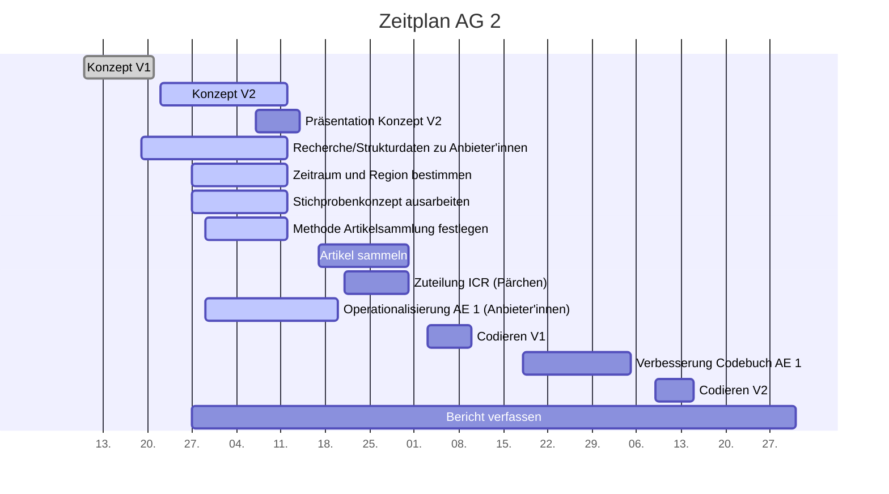

# Projektcontrolling AG 2: Rohdatensammlung

Legende:  on time 🟢 | verzögert 🟡 | kritisch 🟠 | zu spät 🔴 | erledigt: ✔️ | Milestone: 🔷
## Nächste Termine
<!-- erledigte Zeilen  hier einfügen 
| Termin | Lieferobjekt | Status |
| -------- | -------- | -------- | 

--> 
**To be adapted! SAMPLE DATA**
| Termin | Lieferobjekt | Status |
| -------- | -------- | -------- | 
| Mo, 12.10. |Konzept V2 erstellen |🟢| 
|Mo, 12.10.| &#x1F537; Konzeptabgabe| ✔️ |
|Mi, 14.10.| Präsentation erstellen |🟢|
|Mi, 14.10.| &#x1F537; MS Präsentation gehalten | ✔️ |

<!--  NEUE ZEILEN OBEN REINKOPIEREN
Ihr könnt sie unten aus der Tabelle mit den Arbeitspaketen rauskopieren und oben einfügen
-->

----
<!-- Bitte jeweils den neusten zuoberst einfügen -->

## Statusbericht vom 18. Oktober
### Lieferobjekte in Arbeit

<!-- Was zu erledigen war. Wo ihr dran seid -->
1. Artikel sammeln
2. Codebuch erstellen – Alarmstufe 🔴

<!-- falls Tabellen benötigt werden
| Column 1 | Column 2 | Column 3 |
| -------- | -------- | -------- |
| Text     | Text     | Text     |

-->
### Entscheidungen / Abklärungen
<!-- Was war zu entscheiden / abzuklären, mit wem.  -->
– – –

### Herausforderungen/Besonderes
<!-- speziell Erwähnenswertes | Abhängigkeiten von anderen AGs-->
Wir hatten bei der letzten Sitzung mit Vanessa das Gefühl, bis 4.11. Zeit für das Codebuch zu haben. Jetzt sind wir ziemlich unter Zeitdruck. Aber es hätte uns sowieso nicht gereicht, früher damit anzufangen...

### Ausblick / Wie geht's weiter?
<!-- Was kommt als nächstes? | kommende Arbeitspakete -->
Bis Dienstag muss das Codebuch stehen

----
## Individueller Zeitplan

----
## Übersicht Arbeitspakete AG2
<!-- erledigte Zeilen löschen oder abhaken: ✔️ -->

Legende: 🟢 on time | verzögert 🟡 | kritisch 🟠 | zu spät 🔴 | erledigt: ✔️ | Milestone: 🔷

| Arbeitspaket | Zeitfenster | Status |
| ------------ | ----------- | ----- |
| Konzept Version 1 | 13.09.2020 - 21.09.2020 |✔️ |
| Recherche/Strukturdaten zu Anbieter'innen sammeln (Liste zusammenstellen)| 19.09.2020 - 12.10.2020 |🟢|
| Zu untersuchenden Zeitraum und Region bestimmen| 27.09.2020 - 12.10.2020| 🟢|
| Methode zur Sammlung der Artikel festlegen| 29.09.2020 - 12.10.2020| |
| Konzept Version 2 zusammentragen| 22.09.2020 - 12.10.2020 | ✔️ 🔷|
| Präsentation zu Konzept Version 2 erstellen | 2020-10-07, 2020-10-14| ✔️ |
| Präsentation zu Konzept Version 2 halten | 14.10.2020 | ✔️ 🔷
|Operationalisierung der Analyseeinheit 1 (Anbieter'innen) | 29.09.2020 - 20.10.2020| 🟠 🔷 |
| Artikel sammeln | 16.10.2020 - 29.10.2020| 🔷 |
| Zuteilung für ICR (Pärchenbildung, Artikelzuteilung - Absprache mit AG2) | 21.10.2020 - 31.10.2020 |  |
|Codieren mit Codebuch V1 | 03.11.2020 - 10.11.2020| |
|Verbesserung des eigenen Codebuch-Teils (Anbieter'innen) | 18.11.2020 - 05.12.2020| |
|Codieren mit Codebuch V2| 09.12.2020 - 15.12.2020| |
|Bericht verfassen| 27.09.2020 - 31.12.2020| 🔷 |

----

----