# Projektcontrolling AG 3: Datenmanagement

Legende: 🟢 on time | verzögert 🟡 | kritisch 🟠 | zu spät 🔴 | erledigt: ✔️ | Milestone: 🔷
## Nächste Termine
<!-- erledigte Zeilen  hier einfügen 
| Termin | Lieferobjekt | Status |
| -------- | -------- | -------- | 

-->
**To be adapted! SAMPLE DATA**
| Termin | Lieferobjekt | Status |
| -------- | -------- | -------- | 
|Di, 10.11.| Codieren mit Codebuch V1| |
|Di, 20.10.| &#x1F537; Operationalisierung der Analyseeinheit 2 (Artikel) |✔️ |
|Mo, 12.10.| Konzept V2 erstellen |✔️| 
|Mo, 12.10.| &#x1F537; Konzeptabgabe|✔️|
|Mi, 14.10.| Präsentation erstellen |✔️|
|Mi, 14.10.| &#x1F537; MS Präsentation gehalten |✔️|
<!--  NEUE ZEILEN OBEN REINKOPIEREN
Ihr könnt sie unten aus der Tabelle mit den Arbeitspaketen rauskopieren und oben einfügen; die Idee wär, dass "alte" Daten oben rausfliegen, und neue unten "nachrücken". der 20. wäre also unten sinnvoller, aber Merci pour l'effort! 
-->

----
<!-- Bitte jeweils den neusten zuoberst einfügen -->
## Statusbericht vom 25. Oktober
### Lieferobjekte in Arbeit

<!-- Was zu erledigen war. Wo ihr dran seid -->
Unser Teil des Codebuches wurde an die AG4 weitergeleitet
Unsere Hypothesen und Forschungsfragen wurden an die AG4 mitgeteilt
Nach dem ersten Feeback der AG4 müssen evtl. noch ein paar Anpassungen gemacht werden und Entscheidungen/Abklärungen getroffen werden

<!-- falls Tabellen benötigt werden
| Column 1 | Column 2 | Column 3 |
| -------- | -------- | -------- |
| Text     | Text     | Text     |

-->
### Entscheidungen / Abklärungen
<!-- Was war zu entscheiden / abzuklären, mit wem.  -->
Im Moment waren keine Entscheidungen/Abklärungen notwendig
### Herausforderungen/Besonderes
<!-- speziell Erwähnenswertes | Abhängigkeiten von anderen AGs-->
Im Moment keine Herausforderungen
### Ausblick / Wie geht's weiter?
<!-- Was kommt als nächstes? | kommende Arbeitspakete -->
Als nächstes wird ab dem 03.11. mit dem Codebuch V1 codiert

## Statusbericht vom 18. Oktober
### Lieferobjekte in Arbeit

<!-- Was zu erledigen war. Wo ihr dran seid -->
Erste Version unseres Codebuch-Teils wurde erstellt
Erstes Test-Codieren von 3 Artikeln bis am 19.10.20
Besprechung und Endfassung Codebuchteil V1 am 19.10.20
Abgabe Codebuchteil V1 an AG4 bis am 20.10.20

<!-- falls Tabellen benötigt werden
| Column 1 | Column 2 | Column 3 |
| -------- | -------- | -------- |
| Text     | Text     | Text     |

-->
### Entscheidungen / Abklärungen
<!-- Was war zu entscheiden / abzuklären, mit wem.  -->
Entscheid Codebuch:
Folgende (von der PL vorgeschlagene) Leistungskategorien werden nicht von uns abgedeckt:
Attraktivität (betrifft unserer Meinung nach Ebene Website)
Objektivität (betrifft unserer Meinung nach Ebene Statement )
Vielfalt (betrifft unserer Meinung nach Ebene Website, Akteure und Statement)
Interaktivität ist noch offen, je nach Antwort von AG2

Folgende Anfrage haben wir an AG2 versendet:
1) Habt ihr evtl. ein Beispiel-Artikel, den ihr uns zusenden könntet? Wir müssten wissen, ob die Artikel mit Kommentaren/Bewertungen etc. geschickt werden.
2) Welche Medien sind aktuell in der Auswahl? Es hat ja noch Änderungen gegeben von eurer Auflistung in eurem Konzept. Und auf die Präsentation haben wir ja blöderweise keinen Zugriff, damit wir nachschauen könnten...
3) Welche Ressort-Bezeichnungen gibt es alle? Habt ihr da eine Auflistung?
### Herausforderungen/Besonderes
<!-- speziell Erwähnenswertes | Abhängigkeiten von anderen AGs-->
siehe oben: Antwort von AG2 noch ausstehend, hat Einfluss auf unseren Teil des Codebuches
### Ausblick / Wie geht's weiter?
<!-- Was kommt als nächstes? | kommende Arbeitspakete -->
siehe oben: das Codebuch fertigstellen und an AG4 versenden

----
## Individueller Zeitplan

```mermaid
gantt
  dateFormat  YYYY-MM-DD
  axisFormat  %d.
  title Zeitplan AG 3

 Konzept V1 :done, 2020-09-10, 2020-09-21
  Recherche Software Datenerfassung/auswertung:done, 2020-09-10, 2020-09-29
  Empfehlung Software Datenerfassung/auswertung:done, 2020-09-27, 2020-10-12
  Konzept V2 :done, 2020-09-22, 2020-10-12
  Präsentation Konzept V2 : 2020-10-7, 2020-10-14
  Operationalisierung AE 2 (Artikel):done, 2020-09-29, 2020-10-12
  Überarbeitung Operationalisierung:active, 2020-10-12, 2020-10-20
  Codieren V1: 2020-11-03, 2020-11-10
  Verbesserung Codebuch AE 2: 2020-11-18, 2020-12-05
  Codieren V2: 2020-12-09, 2020-12-15
  Datenauswertung: 2020-12-16, 2021-01-05
  Bericht verfassen: 2020-09-27, 2021-01-05
  
```

<!-- Dieses GANTT haben wir mit [mermaid](https://pad.gwdg.de/features?both#Mermaid) erstellt.-->

----
## Übersicht Arbeitspakete
<!-- erledigte Zeilen löschen oder abhaken: ✔️ -->

Legende: 🟢 on time | verzögert 🟡 | kritisch 🟠 | zu spät 🔴 | erledigt: ✔️ | Milestone: 🔷

| Arbeitspaket | Zeitraum | Status |
| ------------ | ----------- | ----- |
| Konzept Version 1 | 13.09.2020 - 21.09.2020 |✔️|
| Recherche Software für Erfassung und Auswertung der Daten | 10.09.2020 - 29.09.2020 |✔️|
| Empfehlung Software für Erfassung und Auswertung der Daten | 29.09.2020 - 12.10.2020 |✔️| 
| Konzept Version 2 zusammentragen| 22.09.2020 - 12.10.2020 |🔷✔️|
| Präsentation zu Konzept Version 2 erstellen | 07.10.2020 - 14.10.2020| ✔️|
| Präsentation zu Konzept Version 2 halten | 14.10.2020 |🔷✔️
|Operationalisierung der Analyseeinheit 2 (Artikel) | 29.09.2020 - 20.10.2020|🔷✔️ |
|Codieren mit Codebuch V1 | 03.11.2020 - 10.11.2020| |
|Verbesserung des eigenen Codebuch-Teils (Artikel) | 18.11.2020 - 05.12.2020| |
|Codieren mit Codebuch V2| 09.12.2020 - 15.12.2020 | |
| Datenauswertung (inhaltliche Analyse) Codierung V2 |  16.12.2020 - 05.01.2021 | |
|Bericht verfassen| 27.09.2020 - 05.01.2021|🔷 |

----