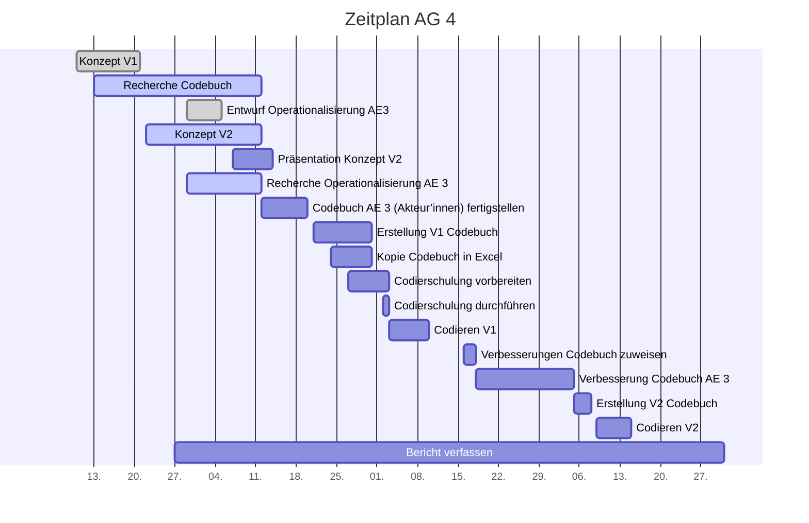

# Projektcontrolling AG 4: Codebuchentwicklung

Legende: 🟢 on time | verzögert 🟡 | kritisch 🟠 | zu spät 🔴 | erledigt: ✔️ | Milestone: 🔷
## Nächste Termine
<!-- erledigte Zeilen  hier einfügen 
| Termin | Lieferobjekt | Status |
| -------- | -------- | -------- | 

-->

| Lieferobjekt | Termin | Status |
| -------- | -------- | -------- | 
| Operationalisierung der Analyseeinheit 3 finalisieren (Akteur'innen) | 20.10.2020|🔷 🟢|
| Raster für Datenerfassung erstellen | 23.10.2020 | 🟢 |
| Übertragung des Codebuchs in Raster für Codierung V1 | 31.10.2020  |🟢
| Codierschulung für AG2-5 vorbereiten | 03.11.2020 | 🟢
| Codierschulung für AG2-5 durchführen | 03.11.2020 | 🔷🟢|

<!--  NEUE ZEILEN OBEN REINKOPIEREN
Ihr könnt sie unten aus der Tabelle mit den Arbeitspaketen rauskopieren und oben einfügen
-->

----
<!-- Bitte jeweils den neusten zuoberst einfügen -->

## Statusbericht vom 18. Oktober
### Lieferobjekte in Arbeit

<!-- Was zu erledigen war. Wo ihr dran seid -->
- Finalisierung der Operationalisierung bis 20.10.20 (Zuständig: Sandra)
- Digitaler Codebogen bis 26.10.20 erstellen (Zuständig:Tamara) -> Entwurf an Dozierende schicken
- Codebuch bis 26.10.20 fertigstellen -> Entwurf an Dozierende schicken (Zuständig: Jo, unterstützt durch Sandra)
- Codierschulung vorbereiten + Durchführen (Zuständig: Stefanie)

<!-- falls Tabellen benötigt werden
| Column 1 | Column 2 | Column 3 |
| -------- | -------- | -------- |
| Text     | Text     | Text     |

-->
### Entscheidungen / Abklärungen
<!-- Was war zu entscheiden / abzuklären, mit wem.  -->
* 
### Herausforderungen/Besonderes
<!-- speziell Erwähnenswertes | Abhängigkeiten von anderen AGs-->
* Wir brauchen wir die Durchführung der Codierschulung Artikelbeispiele von der AG2 (Stefanie klärt ab)

### Ausblick / Wie geht's weiter?
<!-- Was kommt als nächstes? | kommende Arbeitspakete -->
Bis 3.11.2020 muss alles für die folgende Codierphase vorbereitet sein.

----
## Individueller Zeitplan AG 4
<!-- Dieses GANTT haben wir mit [mermaid](https://pad.gwdg.de/features?both#Mermaid) erstellt.-->

----
## Übersicht Arbeitspakete
<!-- erledigte Zeilen löschen oder abhaken: ✔️ -->

Legende: 🟢 on time | verzögert 🟡 | kritisch 🟠 | zu spät 🔴 | erledigt: ✔️ | Milestone: 🔷

| Arbeitspaket | Zeitraum | Status |
| ------------ | ----------- | ----- |
| Konzept Version 1 | 13.09.2020 - 21.09.2020 |✔️ |
| Recherche Codebuch | 13.09.2020 - 12.10.2020 | ✔️|
| Entwurf Operationalisierung AE 3 (Akteur'innen) an AG1 zwecks Feedback | 29.09.2020 - 05.10.2020 |✔️  |
| Konzept Version 2 zusammentragen| 22.09.2020 - 12.10.2020 | 🔷✔️|
| Präsentation zu Konzept Version 2 erstellen | 07.10.2020 - 14.10.2020| ✔️|
| Präsentation zu Konzept Version 2 halten | 14.10.2020 | 🔷✔️|
| Operationalisierung der Analyseeinheit 3 finalisieren (Akteur'innen) | 29.09.2020 - 20.10.2020|🔷 🟢|
| Raster für Datenerfassung erstellen | 14.10.2020 - 23.10.2020 | 🟢 |
| Übertragung des Codebuchs in Raster für Codierung V1 | 21.10.2020 - 31.10.2020  |🟢
| Codierschulung für AG2-5 vorbereiten | 27.10.2020 - 03.11.2020 | 🟢
| Codierschulung für AG2-5 durchführen | 03.11.2020 | 🔷|
| Codieren mit Codebuch V1 | 03.11.2020 - 10.11.2020| |
| Zuweisung der zu verbessernden Teil-Codebücher an AGs | 16.11.2020 - 18.11.2020| |
| Verbesserung des eigenen Codebuch-Teils (Akteur'innen) | 18.11.2020 - 05.12.2020| |
| Zusammenführung Version 2 des Codebuchs | 05.12.2020 - 08.12.2020 | 🔷|
| Codieren mit Codebuch V2| 09.12.2020 - 15.12.2020 | |
| Bericht verfassen| 27.09.2020 - 31.12.2020|🔷 |

----
