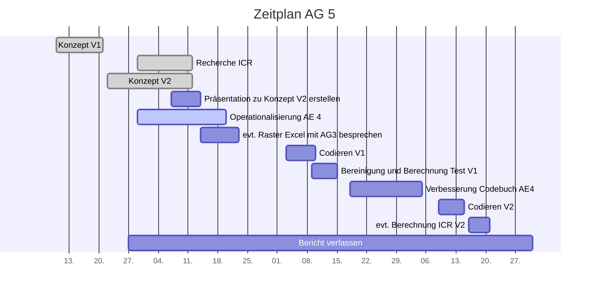

# Projektcontrolling AG 5: Inter-Codierer-Reliabilitätstest

Legende: on time 🟢| verzögert 🟡 | kritisch 🟠 | zu spät 🔴 | erledigt: ✔️ | Milestone: 🔷
## Nächste Termine
<!-- erledigte Zeilen  hier einfügen 
| Termin | Lieferobjekt | Status |
| -------- | -------- | -------- | 

-->

<!-- ev. nur bei Arbeitspakte. sonst doppelt :-) sorry kommentar von alex
Liebe Alex, nein, wir hätten gern hier oben als Übersicht die nächsten zwei, drei Termine. Und ja, das ist doppelt, aber unten müsst ihr nicht ausfüllen, da könnt ihr, und ihr könnt euch dort die APs holen
-->
| Termin | Lieferobjekt | Status |
| -------- | -------- | -------- | 
|Di, 20.10. |Teil-Codebuch Statement erstellen |🟢| 
|10.11.| Codieren mit Codebuch V1||
|15.11.| Datenbereinigung und anschliessende Berechnung des ICR V1||
<!--  NEUE ZEILEN OBEN REINKOPIEREN
Ihr könnt sie unten aus der Tabelle mit den Arbeitspaketen rauskopieren und oben einfügen
-->

----
<!-- Bitte jeweils den neusten zuoberst einfügen -->

## Statusbericht vom 18. Oktober
### Lieferobjekte in Arbeit

<!-- Was zu erledigen war. Wo ihr dran seid -->
Konzept V2 wurde eingereicht sowie die Präsentation dazu gehalten. Die darin vorgeschlagenen Kategorien mussten stark überarbeitet werden und werden als 'Teil-Codebuch Statement-Ebene' bis Dienstag, 20.10. an die AG 4 abgegeben. Je nach Feedback von AG 4 und evtl. Dozierenden sowie der PL muss dieses noch überarbeitet werden. Die nächsten Lieferobjekte wären dann die Erstellung eines Templates um den ICR-Test durchzuführen sowie die codierten Artikel mit dem Codebuch V1.

<!-- falls Tabellen benötigt werden
| Column 1 | Column 2 | Column 3 |
| -------- | -------- | -------- |
| Text     | Text     | Text     |

-->
### Entscheidungen / Abklärungen
<!-- Was war zu entscheiden / abzuklären, mit wem.  -->
* Kategorien auf Statement-Ebene (AG-intern): Ergebnisse in Teil-Codebuch
* Koeffizient für ICR-Test (mit C. Dalmus): Krippendorff’s Alpha
* Wer die Paare von Codierenden bildet und ihnen die Artikel zuweist (mit AG 2): AG 2
* Wer die Werte für den ICR festlegt (mit C. Dalmus): AG 5
* Wer das Template für die Codierung erstellt (mit AG 4): AG 4

### Herausforderungen / Besonderes
<!-- speziell Erwähnenswertes | Abhängigkeiten von anderen AGs-->
Betreffend ICR-Test: Keine Erfahrung mit SSPS, Formel in Excel sehr abstrakt. Die Operationalisierung der Kategorien auf Statement-Ebene stellte eine grosse Heraudforderung dar.

### Ausblick / Wie geht's weiter?
<!-- Was kommt als nächstes? | kommende Arbeitspakete -->
ICR-Test: Entscheid Tool für Test (Excel oder SSPS) noch offen. SSPS wird installiert und getestet. Auch warten wir das Feedback zu unserem Teil-Codebuch ab.

----
## Individueller Zeitplan AG 5
<!-- Dieses GANTT haben wir mit [mermaid](https://pad.gwdg.de/features?both#Mermaid) erstellt.-->

----
## Übersicht Arbeitspakete
<!-- erledigte Zeilen löschen oder abhaken: ✔️ -->

Legende: 🟢 on time | verzögert 🟡 | kritisch 🟠 | zu spät 🔴 | erledigt: ✔️ | Milestone: 🔷

| Arbeitspaket | Zeitraum | Status |
| ------------ | ----------- | ----- |
| Konzept Version 1 | 13.09.2020 - 21.09.2020 |✔️ |
| Recherche und Vorbereitung auf Inter-Codierer-Reliabilitätstest | 29.09.2020 - 12.10.2020 | ✔️ |
| Konzept Version 2 zusammentragen| 22.09.2020 - 12.10.2020 | ✔️ |
| Präsentation zu Konzept Version 2 erstellen | 07.10.2020 - 14.10.2020 |✔️ |
| Präsentation zu Konzept Version 2 halten | 14.10.2020 | ✔️
| Details zu ICR-Test (Auswahl Tool, Erstellung Template, Werte für die Interpretation festlegen) | 03.11. | 🟢 |
|Operationalisierung der Analyseeinheit 4 (Statement) | 29.09.2020 - 20.10.2020|🟢|
|Codieren mit Codebuch V1 | 03.11.2020 - 10.11.2020| |
|Datenbereinigung und anschliessende Berechnung des ICR V1 | 09.11.2020 - 15.11.2020| 🔷|
|Verbesserung des eigenen Codebuch-Teils (Statement) | 18.11.2020 - 05.12.2020| |
|Codieren mit Codebuch V2| 09.12.2020 - 15.12.2020 |  |
|Berechnung des ICR V2 | 16.11.2020 - 20.11.2020| |
|Bericht verfassen| 27.09.2020 - 05.01.2021|🔷 |

----
