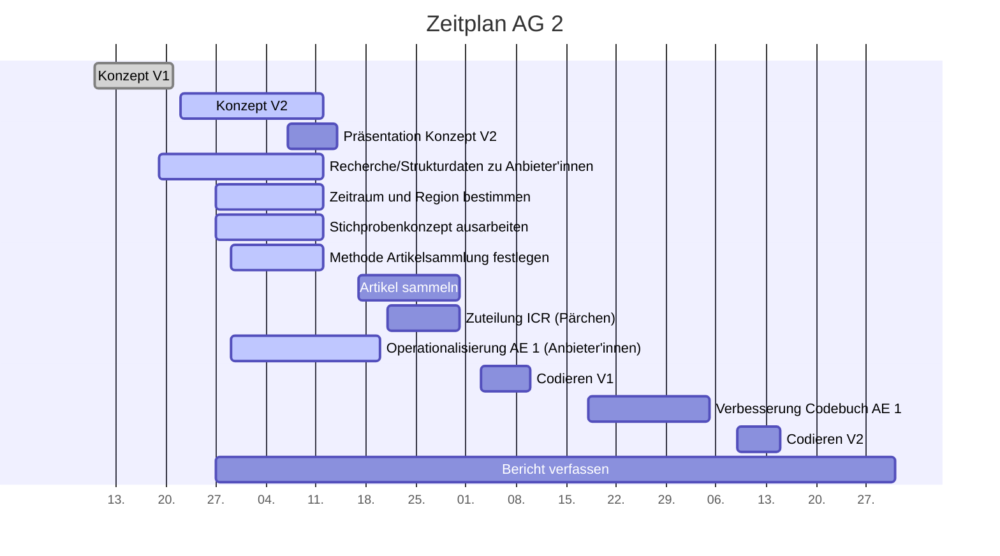

# Projektcontrolling AG 2: Rohdatensammlung

Legende:  on time \emoji{green-circle} | verzögert \emoji{yellow-circle} | kritisch \emoji{orange-circle} | zu spät \emoji{red-circle} | erledigt: \emoji{check-mark} | Milestone: \emoji{large-blue-diamond}

## Nächste Termine
<!-- erledigte Zeilen  hier einfügen 
| Termin | Lieferobjekt | Status |
| -------- | -------- | -------- | 
| Termin | Lieferobjekt | Status |
| -------- | -------- | -------- | 
| Mo, 12.10. |Konzept V2 erstellen |\emoji{check-mark}| 
|Mo, 12.10.| \emoji{large-blue-diamond}; Konzeptabgabe| \emoji{check-mark} |
|Mi, 14.10.| Präsentation erstellen |\emoji{check-mark}|
|Mi, 14.10.| \emoji{large-blue-diamond}; MS Präsentation gehalten | \emoji{check-mark} |
| Di, 20.10. |Codiereinheit Anbieter'innen |\emoji{check-mark} | 
| Do, 29.10. | Artikelsammlung | \emoji{check-mark} |

--> 

| Termin | Lieferobjekt | Status |
| -------- | -------- | -------- | 
 | Sa, 31.10. -> So, 1.11. | Geschichtete Zufallsauswahl |\emoji{green-circle} | 
| Di, 03.11. | Zuteilung Artikel zu Codierer'innen |\emoji{green-circle} | 
| Di, 03.11. | Geschichtete Zufallsauswahl in separaten Ordner |\emoji{green-circle} | 
 Di, 03.11. | Dropbox Zugang an alle versenden|\emoji{green-circle} | 
<!--  NEUE ZEILEN OBEN REINKOPIEREN
Ihr könnt sie unten aus der Tabelle mit den Arbeitspaketen rauskopieren und oben einfügen
-->

<!-- Bitte jeweils den neusten zuoberst einfügen -->
## Statusbericht vom 31. Oktober
### Lieferobjekte in Arbeit

<!-- Was zu erledigen war. Wo ihr dran seid -->
1. Zuteilung ICR (Pärchen)

<!-- falls Tabellen benötigt werden
| Column 1 | Column 2 | Column 3 |
| -------- | -------- | -------- |
| Text     | Text     | Text     |

-->
### Entscheidungen / Abklärungen
<!-- Was war zu entscheiden / abzuklären, mit wem.  -->
Zuteilung Schichten nochmals präzisiert. 

### Herausforderungen/Besonderes
<!-- speziell Erwähnenswertes | Abhängigkeiten von anderen AGs-->
Zeit für alles sehr knapp. Codebuch noch zwei Mal ausgebessert vor definitiver Version 1. Da wir nebenbei noch die Artikel sammeln und diese in Schichten einteilen mussten, war die Woche wieder extrem stressig. 
Geschichtete Zufallsauswahl konnte deshalb noch nicht gemacht werden. Erfolgt am So oder Mo. 

### Ausblick / Wie geht's weiter?
<!-- Was kommt als nächstes? | kommende Arbeitspakete -->
* Zufallsauswahl der Artikel mit Excel-File durchführen. 
* Artikel aus der Ablage in eigenen Ordner kopieren
* Zuteilung der Artikel und Webseiten zu den Codierer'innen mit Excel-File durchführen.
* Allen Codierer'innen einen Dropboxzugang geben.
* Dokument mit Zugangsdaten erstellen
* An Codierschulung teilnehmen
* Mit dem Codieren beginnen

<!-- ## Statusbericht vom 25. Oktober
### Lieferobjekte in Arbeit

1. Artikel sammeln
2. Zuteilung ICR (Pärchen)

### Entscheidungen / Abklärungen

Abklären mit AG 4: Brauchen sie bereits vorher Artikel.

### Herausforderungen/Besonderes
Eine Zeitung hat seit einem Monat nichts mehr publiziert, obwohl es eigentlich eine Wochenzeitung wäre... Wir warten bis Di ab und müssen sonst notfalls "alte" Artikel sammeln, die eigentlich gar nicht im Untersuchungszeitraum liegen. 

### Ausblick / Wie geht's weiter?
Bis am Donnerstag sollten alle Artikel gesammelt werden. Da fehlen noch ca. 4 Plattformen, sollte also gehen.
Beim Sammeln der Artikel wurde bereits eine Grobeinteilung in Schichten vorgenommen, diese muss noch finalisiert werden. Aus den Schichten wird dann die Zufallsauswahl getroffen. 
Danach erfolgt die Zuteilung der Artikel zu den Codierer'innen.

-->

## Individueller Zeitplan

## Übersicht Arbeitspakete AG2
<!-- erledigte Zeilen löschen oder abhaken: \emoji{check-mark} -->

Legende: \emoji{green-circle} on time | verzögert \emoji{yellow-circle} | kritisch \emoji{orange-circle} | zu spät \emoji{red-circle} | erledigt: \emoji{check-mark} | Milestone: \emoji{large-blue-diamond}

| Arbeitspaket | Zeitfenster | Status |
| ------------ | ----------- | ----- |
| Konzept Version 1 | 13.09.2020 - 21.09.2020 |\emoji{check-mark} |
| Recherche/Strukturdaten zu Anbieter'innen sammeln (Liste zusammenstellen)| 19.09.2020 - 12.10.2020 |\emoji{check-mark}|
| Zu untersuchenden Zeitraum und Region bestimmen| 27.09.2020 - 12.10.2020| \emoji{check-mark}|
| Methode zur Sammlung der Artikel festlegen| 29.09.2020 - 12.10.2020| \emoji{check-mark}|
| Konzept Version 2 zusammentragen| 22.09.2020 - 12.10.2020 | \emoji{check-mark} \emoji{large-blue-diamond}|
| Präsentation zu Konzept Version 2 erstellen | 2020-10-07, 2020-10-14| \emoji{check-mark} |
| Präsentation zu Konzept Version 2 halten | 14.10.2020 | \emoji{check-mark} \emoji{large-blue-diamond}
|Operationalisierung der Analyseeinheit 1 (Anbieter'innen) | 29.09.2020 - 20.10.2020| \emoji{check-mark} \emoji{large-blue-diamond} |
| Artikel sammeln | 16.10.2020 - 29.10.2020| \emoji{green-circle}\emoji{large-blue-diamond} |
| Zuteilung für ICR (Pärchenbildung, Artikelzuteilung - Absprache mit AG2) | 21.10.2020 - 31.10.2020 |  |
| Codierschulungsteil vorbereiten | 27.10.2020 - 03.11.2020 | 
| Codierschulung für eigenen Teil durchführen | 03.11.2020 | \emoji{large-blue-diamond}|
|Codieren mit Codebuch V1 | 03.11.2020 - 10.11.2020| |
|Verbesserung des eigenen Codebuch-Teils (Anbieter'innen) | 18.11.2020 - 05.12.2020| |
|Codieren mit Codebuch V2| 09.12.2020 - 15.12.2020| |
|Bericht verfassen| 27.09.2020 - 31.12.2020| \emoji{large-blue-diamond} |

