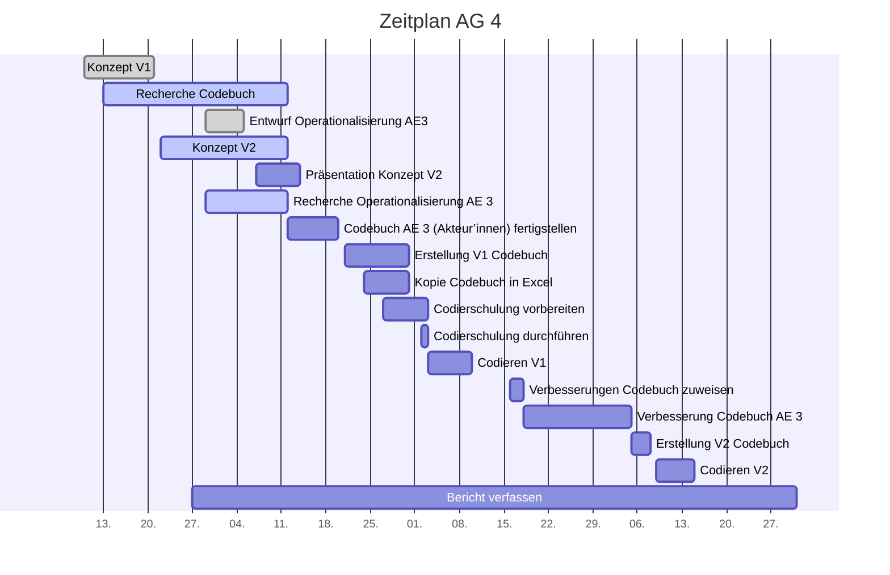

# Projektcontrolling AG 4: Codebuchentwicklung

Legende: \emoji{green-circle} on time | verzögert \emoji{yellow-circle} | kritisch \emoji{orange-circle} | zu spät \emoji{red-circle} | erledigt: \emoji{check-mark} | Milestone: \emoji{large-blue-diamond}

## Nächste Termine

<!-- erledigte Zeilen  hier einfügen 
| Termin | Lieferobjekt | Status |
| Operationalisierung der Analyseeinheit 3 finalisieren (Akteur'innen) | 20.10.2020|\emoji{large-blue-diamond} \emoji{green-circle} 
| Raster für Datenerfassung erstellen | 23.10.2020 | \emoji{green-circle} |
| Übertragung des Codebuchs in Raster für Codierung V1 | 31.10.2020  |\emoji{green-circle}
| Codierschulung für AG2-5 vorbereiten | 03.11.2020 | \emoji{green-circle}
-->

| Lieferobjekt | Termin | Status |
| -------- | -------- | -------- | 
| Codierschulung für AG2-5 durchführen | 03.11.2020 | \emoji{large-blue-diamond}\emoji{green-circle}|
| Codieren mit Codebuch V1 | 03.11.2020 - 10.11.2020| \emoji{green-circle}|
| Zuweisung der zu verbessernden Teil-Codebücher an AGs | 16.11.2020 - 18.11.2020|\emoji{green-circle} |

<!--  NEUE ZEILEN OBEN REINKOPIEREN
Ihr könnt sie unten aus der Tabelle mit den Arbeitspaketen rauskopieren und oben einfügen
-->

## Statusbericht vom 1. November

### Lieferobjekte in Arbeit
--
### Entscheidungen / Abklärungen
<!-- Was war zu entscheiden / abzuklären, mit wem.  -->
* Wie und an wen werden die ausgefüllten Codebogen abgegeben? Soll an Codierschulung mitgeteilt werden. AG5 klärt intern ab und teilt mit.

### Herausforderungen/Besonderes
<!-- speziell Erwähnenswertes | Abhängigkeiten von anderen AGs-->
* Am 3.11 ist die Codierschulung. Wahrscheinlich kommen noch "Probleme" zum Vorschein. Die Codierphase beginnt aber gemäss Planung sofort. Falls dringende Anpassungen in Codebuch/Codebogen nötig sind, kann die Codierphase frühestens am Do, 5. November beginnen, damit wir am Mittwoch Abend die Dokumente noch aktualisieren können.
### Ausblick / Wie geht's weiter?
<!-- Was kommt als nächstes? | kommende Arbeitspakete -->
* Codierschulung vom 3.11 ist nächster Meilenstein.

<!-- Bitte jeweils den neusten zuoberst einfügen -->

## Statusbericht vom 25. Oktober
### Lieferobjekte in Arbeit

<!-- Was zu erledigen war. Wo ihr dran seid -->
- Digitaler Codebogen bis 26.10.20 erstellen (Zuständig:Tamara) -> Entwurf an Dozierende schicken
- Codebuch bis 26.10.20 fertigstellen -> Entwurf an Dozierende schicken (Zuständig: Jo/Sandra)
- Codierschulung vorbereiten + Durchführen (Zuständig: Stefanie) -> Konzept am 26.10 an Dozierende schicken

<!-- falls Tabellen benötigt werden
| Column 1 | Column 2 | Column 3 |
| -------- | -------- | -------- |
| Text     | Text     | Text     |

-->
### Entscheidungen / Abklärungen
<!-- Was war zu entscheiden / abzuklären, mit wem.  -->
* Wo ist die Zuteilung der Artikel/Websites zu den Codierern ersichtlich? In einem weiteren Tabellenblatt im Codebogen? In Abklärung...
### Herausforderungen/Besonderes
<!-- speziell Erwähnenswertes | Abhängigkeiten von anderen AGs-->
* Am 3.11 ist die Codierschulung. Wahrscheinlich kommen noch "Probleme" zum Vorschein. Die Codierphase beginnt aber gemäss Planung sofort. Falls viele Anpassungen nötig sind, muss die Codierphase ev. 1-2 Tage herausgeschoben werden, weil wir dann sonst eine Nachtschicht schieben...
* Es ist unklar wie "zufrieden" die Dozierenden mit den Kategoriensystemen sein werden. Vermutlich haben nicht alle AGs ihre Kategorien mit den Dozierenden abgesprochen. Es ist möglich, dass noch sehr viele Änderungen nötig sind. Vielleicht können wir das Codebuch mit eingebautem Feedback der Dozierenden nicht schon am 31.10 verschicken...schwierig abzuschätzen.
<!--Bitte die alten Bericht nicht löschen :) sondern einfach den aktuellen oben einfügen -->
### Ausblick / Wie geht's weiter?
<!-- Was kommt als nächstes? | kommende Arbeitspakete -->
Bis 3.11.2020 muss alles für die folgende Codierphase vorbereitet sein.

## Statusbericht vom 18. Oktober
Versehentlich gelöscht. War alles ok...

## Individueller Zeitplan AG 4
<!-- Dieses GANTT haben wir mit [mermaid](https://pad.gwdg.de/features?both#Mermaid) erstellt.-->

## Übersicht Arbeitspakete
<!-- erledigte Zeilen löschen oder abhaken: \emoji{check-mark} -->

Legende: \emoji{green-circle} on time | verzögert \emoji{yellow-circle} | kritisch \emoji{orange-circle} | zu spät \emoji{red-circle} | erledigt: \emoji{check-mark} | Milestone: \emoji{large-blue-diamond}

| Arbeitspaket | Zeitraum | Status |
| ------------ | ----------- | ----- |
| Konzept Version 1 | 13.09.2020 - 21.09.2020 |\emoji{check-mark} |
| Recherche Codebuch | 13.09.2020 - 12.10.2020 | \emoji{check-mark}|
| Entwurf Operationalisierung AE 3 (Akteur'innen) an AG1 zwecks Feedback | 29.09.2020 - 05.10.2020 |\emoji{check-mark}  |
| Konzept Version 2 zusammentragen| 22.09.2020 - 12.10.2020 | \emoji{check-mark}|
| Präsentation zu Konzept Version 2 erstellen | 07.10.2020 - 14.10.2020| \emoji{check-mark}|
| Präsentation zu Konzept Version 2 halten | 14.10.2020 | \emoji{check-mark}|
| Operationalisierung der Analyseeinheit 3 finalisieren (Akteur'innen) | 29.09.2020 - 20.10.2020|\emoji{check-mark}|
| Raster für Datenerfassung erstellen | 14.10.2020 - 23.10.2020 | \emoji{check-mark} |
| Übertragung des Codebuchs in Raster für Codierung V1 | 21.10.2020 - 31.10.2020  |\emoji{check-mark}
| Codierschulung für AG2-5 vorbereiten | 27.10.2020 - 03.11.2020 | \emoji{check-mark}
| Codierschulung für AG2-5 durchführen | 03.11.2020 | \emoji{large-blue-diamond}|
| Codieren mit Codebuch V1 | 03.11.2020 - 10.11.2020| |
| Zuweisung der zu verbessernden Teil-Codebücher an AGs | 16.11.2020 - 18.11.2020| |
| Verbesserung des eigenen Codebuch-Teils (Akteur'innen) | 18.11.2020 - 05.12.2020| |
| Zusammenführung Version 2 des Codebuchs | 05.12.2020 - 08.12.2020 | \emoji{large-blue-diamond}|
| Codieren mit Codebuch V2| 09.12.2020 - 15.12.2020 | |
| Bericht verfassen| 27.09.2020 - 31.12.2020|\emoji{large-blue-diamond} |

