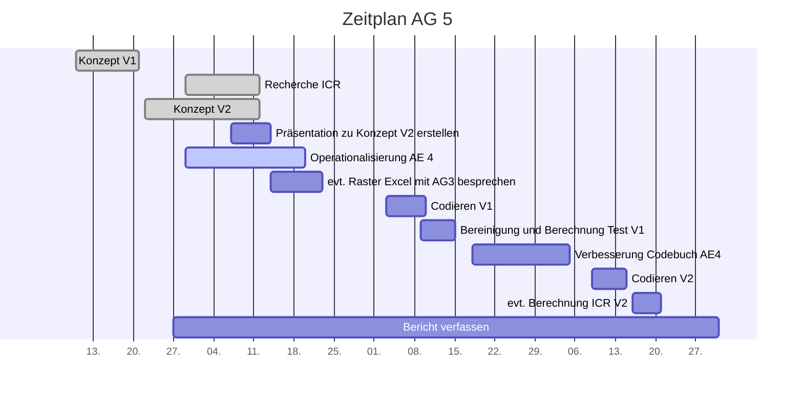

# Projektcontrolling AG 5: Inter-Codierer-Reliabilitätstest

Legende: on time \emoji{green-circle}| verzögert \emoji{yellow-circle} | kritisch \emoji{orange-circle} | zu spät \emoji{red-circle} | erledigt: \emoji{check-mark} | Milestone: \emoji{large-blue-diamond}

## Nächste Termine
<!-- erledigte Zeilen  hier einfügen 
| Termin | Lieferobjekt | Status |
| Di, 20.10. | Teil-Codebuch Statement erstellen | \emoji{green-circle} | 

-->

| Termin | Lieferobjekt | Status |
| -------- | -------- | -------- |  
|14.11.| Codieren mit Codebuch V1|\emoji{green-circle}|
|15.11.| Datenbereinigung und anschliessende Berechnung des ICR V1||
<!--  NEUE ZEILEN OBEN REINKOPIEREN
Ihr könnt sie unten aus der Tabelle mit den Arbeitspaketen rauskopieren und oben einfügen
-->

## Statusbericht vom 8. November

### Lieferobjekte in Arbeit
Die Codierschulung wurde durchgeführt und anschliessend ein paar Punkte im Codebuch-Teil (Statement-Ebene) geändert. Momentan codieren wir mit dem Codebuch V1.

### Entscheidungen / Abklärungen
Während der Codierschulung wurden einige Fragen im Zusammenhang mit der Statement-Ebene geklärt. Es hat sich z.B. eine Kategorie ergeben, die das Thema des Statements erfassen soll (neu S2). Auch haben wir den Einleitungstext im Codebuch-Teil etwas angepasst. Ausserdem hat Alexandra frühzeitig (vor Beginn des Codierens) bemerkt, dass die Artikelzuteilung, welche in der Verantwortung von AG2 liegt, fehlerhaft war. Wir haben dies gemeldet und so konnte es rechtzeitig behoben werden.

### Herausforderungen / Besonderes
Zwei von uns haben mittlerweile versucht, SPSS zu installieren, aber es scheint mit Mac nicht trivial zu sein, insb. das Einbinden der benötigten Makros bereitet Probleme. In den Gesprächen mit C. Dalmus klingt das Berechnen jeweils sehr trivial aber noch haben wir uns weder für ein Tool entschieden noch ein Gerüst, mit dem wir berechnen können. Auch ist das Codieren mit V1 herausfordernd; es fallen viele Fragen im gemeinsamen Dokument an.

### Ausblick / Wie geht's weiter?
Codieren mit V1 abschliessen. Wir müssen uns mit SPSS und Excel vertraut machen bzw. uns für ein Tool entscheiden und ein Gerüst für die ICR-Berechnung erstellen.

## Statusbericht vom 1. November

### Lieferobjekte in Arbeit
Zu unserem Teil-Codebuch gab es kein Feedback seitens AG4 und den Dozierenden. Somit mussten wir keine Änderungen vornehmen; lediglich die Ergänzung der Ausprägung '77' in zwei Kategorien. Die Codierschulung zu unserem Teil wird bis Dienstag, 3.11., vorbereitet.

### Entscheidungen / Abklärungen
Innerhalb der AG5 muss bis Dienstag, 3.11. geklärt werden, wie und wo die Codierenden ihre ausgefüllten Excel-Sheets an uns übergeben bzw. ablegen. Zur Auswahl stehen E-Mail oder Ablage in unserem Drive-Ordner. Wir sind bisher von dem Weg über E-Mail ausgegangen, möchten aber nochmals diskutieren, inwiefern es notwendig ist, dass die Codierenden keinen Einblick in andere Excel-Sheets erhalten können.

### Herausforderungen / Besonderes
Demnächst werden wir uns SPSS anschauen müssen, da es als Auswertungstool infrage kommt. Dies stellt eine gewisse Herausforderung dar, da bisher niemand von uns damit gearbeitet hat.

### Ausblick / Wie geht's weiter?
Vorbereitung und Durchführung der Codierschulung am 3.11. Zudem Details betreffend ICR-Test klären und vertiefen; Wahl des Tools, verwendete Formeln. 

## Statusbericht vom 25. Oktober

### Lieferobjekte in Arbeit
Das Teil-Codebuch zur Statement-Ebene wurde eingereicht. Das von der AG4 erstellte Codebuch V1 wurde kontrolliert sowie ein Feedback abgegeben. Nun warten wir das Feedback der Dozierenden ab. Sobald wir dieses haben, können wir unseren Teil für die Codierschulung vorbereiten.

### Entscheidungen / Abklärungen
Bei der Erstellung der Teil-Codebücher hat die AG2 erkannt, dass eine Website nach aktuellem Verständnis und Vorgehen 20 Mal codiert wird. Die AG5 wurde in diese Diskussion involviert, da unklar war, ob ein anderes Vorgehen Einfluss auf den ICR-Test bzw. das Kettensystem hätte. Nach Absprache mit C. Dalmus wurde entschieden, dass die Ebene Website innerhalb des Kettensystems nicht berücksichtigt und somit "separat" codiert werden soll. Doch auch hier gilt, dass eine Website von jeweils zwei Personen codiert wird. 

### Herausforderungen / Besonderes
Demnächst werden wir uns SPSS anschauen müssen, da es als Auswertungstool infrage kommt. Dies stellt eine gewisse Herausforderung dar, da bisher niemand von uns damit gearbeitet hat.

### Ausblick / Wie geht's weiter?
Wir warten das Feedback zum Teil-Codebuch von den Dozierenden ab und nehmen ggfls. Änderungen vor. Darauf aufbauend bereiten wir unseren Beitrag zur Codierschulung vor. Gleichzeitig müssen die Details zum ICR-Test geklärt werden: Test und Wahl des Tools, ggfls. Vorbereitung eines Templates mit den Formeln.

## Statusbericht vom 18. Oktober

### Lieferobjekte in Arbeit

Konzept V2 wurde eingereicht sowie die Präsentation dazu gehalten. Die darin vorgeschlagenen Kategorien mussten stark überarbeitet werden und werden als 'Teil-Codebuch Statement-Ebene' bis Dienstag, 20.10. an die AG 4 abgegeben. Je nach Feedback von AG 4 und evtl. Dozierenden sowie der PL muss dieses noch überarbeitet werden. Die nächsten Lieferobjekte wären dann die Erstellung eines Templates um den ICR-Test durchzuführen sowie die codierten Artikel mit dem Codebuch V1.

### Entscheidungen / Abklärungen

* Kategorien auf Statement-Ebene (AG-intern): Ergebnisse in Teil-Codebuch
* Koeffizient für ICR-Test (mit C. Dalmus): Krippendorff’s Alpha
* Wer die Paare von Codierenden bildet und ihnen die Artikel zuweist (mit AG 2): AG 2
* Wer die Werte für den ICR festlegt (mit C. Dalmus): AG 5
* Wer das Template für die Codierung erstellt (mit AG 4): AG 4

### Herausforderungen / Besonderes

Betreffend ICR-Test: Keine Erfahrung mit SSPS, Formel in Excel sehr abstrakt. Die Operationalisierung der Kategorien auf Statement-Ebene stellte eine grosse Herausforderung dar.

<!-- falls Tabellen benötigt werden
| Column 1 | Column 2 | Column 3 |
| -------- | -------- | -------- |
| Text     | Text     | Text     |

-->

### Ausblick / Wie geht's weiter?

ICR-Test: Entscheid Tool für Test (Excel oder SSPS) noch offen. SSPS wird installiert und getestet. Auch warten wir das Feedback zu unserem Teil-Codebuch ab.

## Individueller Zeitplan AG 5

## Übersicht Arbeitspakete

Legende: \emoji{green-circle}  on time | verzögert \emoji{yellow-circle} | kritisch \emoji{orange-circle} | zu spät \emoji{red-circle} | erledigt: \emoji{check-mark} | Milestone: \emoji{large-blue-diamond}

| Arbeitspaket | Zeitraum | Status |
| ------------ | ----------- | ----- |
| Konzept Version 1 | 13.09.2020 - 21.09.2020 |\emoji{check-mark} |
| Recherche und Vorbereitung auf Inter-Codierer-Reliabilitätstest | 29.09.2020 - 12.10.2020 | \emoji{check-mark} |
| Konzept Version 2 zusammentragen| 22.09.2020 - 12.10.2020 | \emoji{check-mark} |
| Präsentation zu Konzept Version 2 erstellen | 07.10.2020 - 14.10.2020 |\emoji{check-mark} |
| Präsentation zu Konzept Version 2 halten | 14.10.2020 | \emoji{check-mark}
| Details zu ICR-Test (Auswahl Tool, Erstellung Template, Werte für die Interpretation festlegen) | 03.11.2020 | \emoji{green-circle} |
|Operationalisierung der Analyseeinheit 4 (Statement) | 29.09.2020 - 20.10.2020|\emoji{check-mark}|
| Codierschulungsteil vorbereiten | 27.10.2020 - 03.11.2020 |\emoji{check-mark}
| Codierschulung für eigenen Teil durchführen | 03.11.2020 |\emoji{check-mark}|
|Codieren mit Codebuch V1 | 03.11.2020 - 10.11.2020|\emoji{green-circle}|
|Datenbereinigung und anschliessende Berechnung des ICR V1 | 09.11.2020 - 15.11.2020| \emoji{large-blue-diamond}|
|Verbesserung des eigenen Codebuch-Teils (Statement) | 18.11.2020 - 05.12.2020| |
|Codieren mit Codebuch V2| 09.12.2020 - 15.12.2020 |  |
|Berechnung des ICR V2 | 16.11.2020 - 20.11.2020| |
|Bericht verfassen| 27.09.2020 - 05.01.2021|\emoji{large-blue-diamond} |

