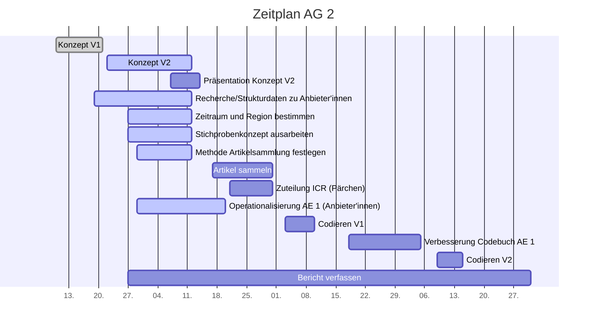

# Projektcontrolling AG 2: Rohdatensammlung

Legende:  on time \emoji{green-circle} | verzögert \emoji{yellow-circle} | kritisch \emoji{orange-circle} | zu spät \emoji{red-circle} | erledigt: \emoji{check-mark} | Milestone: \emoji{large-blue-diamond}

## Nächste Termine
<!-- erledigte Zeilen  hier einfügen 
| Termin | Lieferobjekt | Status |
| -------- | -------- | -------- | 
| Termin | Lieferobjekt | Status |
| -------- | -------- | -------- | 
| Mo, 12.10. |Konzept V2 erstellen |\emoji{check-mark}| 
|Mo, 12.10.| \emoji{large-blue-diamond}; Konzeptabgabe| \emoji{check-mark} |
|Mi, 14.10.| Präsentation erstellen |\emoji{check-mark}|
|Mi, 14.10.| \emoji{large-blue-diamond}; MS Präsentation gehalten | \emoji{check-mark} |
| Di, 20.10. |Codiereinheit Anbieter'innen |\emoji{check-mark} | 
| Do, 29.10. | Artikelsammlung | \emoji{check-mark} |
| Freitag 13.11. | Codebuch v1 codieren |\emoji{check-mark} | 

--> 

| Termin | Lieferobjekt | Status |
| -------- | -------- | -------- | 
| Montag 23.11. - Samstag 5.12. | Problemanalyse und Verbesserung Codebuch Anbieter'innen |\emoji{green-circle} | 
| Mittwoch 09.12. - Dienstag 15.12. | Codebuch v2 codieren |\emoji{green-circle} | 
 Donnerstag 31.12. | Abgabe Projektbericht |\emoji{green-circle} | 
<!--  NEUE ZEILEN OBEN REINKOPIEREN
Ihr könnt sie unten aus der Tabelle mit den Arbeitspaketen rauskopieren und oben einfügen
-->

## Statusbericht vom 22. November

### Lieferobjekte in Arbeit

Feedback Codebuch V1 erhalten, wir sind also bereit, es zu überarbeiten. Das wird uns jetzt bis zum 5. Dezember beschäftigen. 

<!-- falls Tabellen benötigt werden
| Column 1 | Column 2 | Column 3 |
| -------- | -------- | -------- |
| Text     | Text     | Text     |

-->

### Entscheidungen / Abklärungen

\-\-\-\-\-\-

### Herausforderungen/Besonderes

\-\-\-\-\-\-

### Ausblick / Wie geht's weiter?

* Codebuch ausbessern 
* mit v2 Codieren
* immer alles mögliche in den Schlussbericht schreiben
* Schlussbericht bis 31.12. verfassen

<!-- 
## Statusbericht vom 15. November

### Lieferobjekte in Arbeit
Abwarten auf Feedback der Codebuch v1

<!-- falls Tabellen benötigt werden
| Column 1 | Column 2 | Column 3 |
| -------- | -------- | -------- |
| Text     | Text     | Text     |

### Entscheidungen / Abklärungen
\-\-\-\-\-\-

### Herausforderungen/Besonderes

\-\-\-\-\-\-

### Ausblick / Wie geht's weiter?
* Codebuch ausbessern 
* mit v2 Codieren
* immer alles mögliche in den Schlussbericht schreiben
* Schlussbericht bis 31.12. verfassen
-->

<!-- ## Statusbericht vom 25. Oktober

### Lieferobjekte in Arbeit

1. Artikel sammeln
2. Zuteilung ICR (Pärchen)

### Entscheidungen / Abklärungen

Abklären mit AG 4: Brauchen sie bereits vorher Artikel.

### Herausforderungen/Besonderes
Eine Zeitung hat seit einem Monat nichts mehr publiziert, obwohl es eigentlich eine Wochenzeitung wäre... Wir warten bis Di ab und müssen sonst notfalls "alte" Artikel sammeln, die eigentlich gar nicht im Untersuchungszeitraum liegen. 

### Ausblick / Wie geht's weiter?
Bis am Donnerstag sollten alle Artikel gesammelt werden. Da fehlen noch ca. 4 Plattformen, sollte also gehen.
Beim Sammeln der Artikel wurde bereits eine Grobeinteilung in Schichten vorgenommen, diese muss noch finalisiert werden. Aus den Schichten wird dann die Zufallsauswahl getroffen. 
Danach erfolgt die Zuteilung der Artikel zu den Codierer'innen.

-->

## Individueller Zeitplan

## Übersicht Arbeitspakete AG2

Legende: \emoji{green-circle} on time | verzögert \emoji{yellow-circle} | kritisch \emoji{orange-circle} | zu spät \emoji{red-circle} | erledigt: \emoji{check-mark} | Milestone: \emoji{large-blue-diamond}

| Arbeitspaket | Zeitfenster | Status |
| ------------ | ----------- | ----- |
| Konzept Version 1 | 13.09.2020 - 21.09.2020 |\emoji{check-mark} |
| Recherche/Strukturdaten zu Anbieter'innen sammeln (Liste zusammenstellen)| 19.09.2020 - 12.10.2020 |\emoji{check-mark}|
| Zu untersuchenden Zeitraum und Region bestimmen| 27.09.2020 - 12.10.2020| \emoji{check-mark}|
| Methode zur Sammlung der Artikel festlegen| 29.09.2020 - 12.10.2020| \emoji{check-mark}|
| Konzept Version 2 zusammentragen| 22.09.2020 - 12.10.2020 | \emoji{check-mark} \emoji{large-blue-diamond}|
| Präsentation zu Konzept Version 2 erstellen | 2020-10-07, 2020-10-14| \emoji{check-mark} |
| Präsentation zu Konzept Version 2 halten | 14.10.2020 | \emoji{check-mark} \emoji{large-blue-diamond}
|Operationalisierung der Analyseeinheit 1 (Anbieter'innen) | 29.09.2020 - 20.10.2020| \emoji{check-mark} \emoji{large-blue-diamond} |
| Artikel sammeln | 16.10.2020 - 29.10.2020| \emoji{check-mark} \emoji{large-blue-diamond} |
| Zuteilung für ICR (Pärchenbildung, Artikelzuteilung - Absprache mit AG2) | 21.10.2020 - 31.10.2020 | \emoji{check-mark}  |
| Codierschulungsteil vorbereiten | 27.10.2020 - 03.11.2020 | \emoji{check-mark} 
| Codierschulung für eigenen Teil durchführen | 03.11.2020 | \emoji{check-mark} \emoji{large-blue-diamond}|
|Codieren mit Codebuch V1 | 03.11.2020 - 10.11.2020|\emoji{check-mark} |
|Verbesserung des eigenen Codebuch-Teils (Anbieter'innen) | 18.11.2020 - 05.12.2020|\emoji{green-circle} |
|Codieren mit Codebuch V2| 09.12.2020 - 15.12.2020| |
|Bericht verfassen| 27.09.2020 - 31.12.2020| \emoji{large-blue-diamond} |

