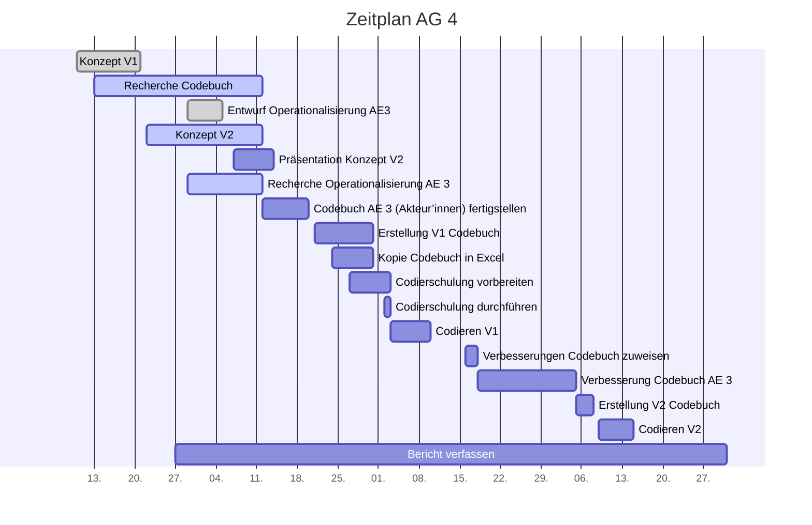

# Projektcontrolling AG 4: Codebuchentwicklung

Legende: \emoji{green-circle} on time | verzögert \emoji{yellow-circle} | kritisch \emoji{orange-circle} | zu spät \emoji{red-circle} | erledigt: \emoji{check-mark} | Milestone: \emoji{large-blue-diamond}

## Nächste Termine

<!-- erledigte Zeilen  hier einfügen 
| Termin | Lieferobjekt | Status |
| Operationalisierung der Analyseeinheit 3 finalisieren (Akteur'innen) | 20.10.2020|\emoji{large-blue-diamond} \emoji{green-circle} 
| Raster für Datenerfassung erstellen | 23.10.2020 | \emoji{green-circle} |
| Übertragung des Codebuchs in Raster für Codierung V1 | 31.10.2020  |\emoji{green-circle}
| Codierschulung für AG2-5 vorbereiten | 03.11.2020 | \emoji{green-circle}
| Codierschulung für AG2-5 durchführen | 03.11.2020 | \emoji{large-blue-diamond}\emoji{green-circle}|
| Codieren mit Codebuch V1 | 06.11.2020 - 13.11.2020| \emoji{green-circle}|
| Zuweisung der zu verbessernden Teil-Codebücher an AGs | 22.11.2020|\emoji{green-circle}|
-->

| Lieferobjekt | Termin | Status |
| -------- | -------- | -------- | 
| Verbesserung des eigenen Codebuch-Teils (Akteur'innen) | 23.11.2020 - 06.12.2020| |
| Zusammenführung Version 2 des Codebuchs | 06.12.2020 - 08.12.2020| \emoji{large-blue-diamond}|
| Codieren mit Codebuch V2| 09.12.2020 - 15.12.2020 | |
| Bericht verfassen| 27.09.2020 - 31.12.2020|\emoji{large-blue-diamond} |

<!--  NEUE ZEILEN OBEN REINKOPIEREN
Ihr könnt sie unten aus der Tabelle mit den Arbeitspaketen rauskopieren und oben einfügen
-->

## Statusbericht vom 22. November

### Ausblick / Wie geht's weiter?

* Verbesserung des eigenen Teilcodebuches bis 6.12 und anschliessende Zusammenführung der Teilcodebücher.

### Entscheidungen / Abklärungen

* Mail an Fr. Dalmus:
    * Dürfen Zellen in Codebogen leer bleiben, damit der Codierprozess beschleunigt werden kann? (wurde an der letzten Sitzung besprochen). AG5 und AG4 haben das nicht gleich verstanden. Mail an Fr. Dalmus am 22.11.20
    * Problem mit Unterscheidung der Codes 0 / 77 / 99. Bitte um Inputs.

## Statusbericht vom 15. November

### Ausblick / Wie geht's weiter?

* ICR-Ergebnisse abwarten und Teilcodebuch verbessern.
* Kategorien und Thesen in Hinblick auf die Auswertung kontrollieren (Mail vom 9.11.20 der AG3)

## Statusbericht vom 8. November

### Lieferobjekte in Arbeit

### Entscheidungen / Abklärungen

* Wie genau soll das "Zuweisung der zu verbessernden Teil-Codebücher an AGs" ablaufen? 
Idee: die AGs erhalten wieder das aktuellste docx-File von der AG4 und ändern ihren Teil anhand der Ergebnisse vom ICR-Test und den gesammelten Fragen ab. 
Es kann davon ausgegangen werden, dass alle Codebücher angepasst werden müssen. 

### Herausforderungen/Besonderes

* Codiervorgang: wie zählt man die Wörter bei einem png?
* Die Definition eines Akteurs/einer Akteurin wird voraussichtlich eine Knacknuss. Die Codierer'innen haben Schwierigkeiten mit der aktuellen Definition (gemäss Fragensammlung).
* Die Überarbeitung des Codebuches wird wahrscheinlich noch einmal viel Arbeit mit sich bringen.

### Ausblick / Wie geht's weiter?

* Codierphase abschliessen. Testergebnisse abwarten.

## Statusbericht vom 1. November

### Lieferobjekte in Arbeit

### Entscheidungen / Abklärungen

* Wie und an wen werden die ausgefüllten Codebogen abgegeben? Soll an Codierschulung mitgeteilt werden. AG5 klärt intern ab und teilt mit.

### Herausforderungen/Besonderes

* Am 3.11 ist die Codierschulung. Wahrscheinlich kommen noch "Probleme" zum Vorschein. Die Codierphase beginnt aber gemäss Planung sofort. Falls dringende Anpassungen in Codebuch/Codebogen nötig sind, kann die Codierphase frühestens am Do, 5. November beginnen, damit wir am Mittwoch Abend die Dokumente noch aktualisieren können.

### Ausblick / Wie geht's weiter?

* Codierschulung vom 3.11 ist nächster Meilenstein.

## Statusbericht vom 25. Oktober

### Lieferobjekte in Arbeit

- Digitaler Codebogen bis 26.10.20 erstellen (Zuständig:Tamara) -> Entwurf an Dozierende schicken
- Codebuch bis 26.10.20 fertigstellen -> Entwurf an Dozierende schicken (Zuständig: Jo/Sandra)
- Codierschulung vorbereiten + Durchführen (Zuständig: Stefanie) -> Konzept am 26.10 an Dozierende schicken

<!-- falls Tabellen benötigt werden
| Column 1 | Column 2 | Column 3 |
| -------- | -------- | -------- |
| Text     | Text     | Text     |

-->

### Entscheidungen / Abklärungen

* Wo ist die Zuteilung der Artikel/Websites zu den Codierern ersichtlich? In einem weiteren Tabellenblatt im Codebogen? In Abklärung...

### Herausforderungen/Besonderes

* Am 3.11 ist die Codierschulung. Wahrscheinlich kommen noch "Probleme" zum Vorschein. Die Codierphase beginnt aber gemäss Planung sofort. Falls viele Anpassungen nötig sind, muss die Codierphase ev. 1-2 Tage herausgeschoben werden, weil wir dann sonst eine Nachtschicht schieben...
* Es ist unklar wie "zufrieden" die Dozierenden mit den Kategoriensystemen sein werden. Vermutlich haben nicht alle AGs ihre Kategorien mit den Dozierenden abgesprochen. Es ist möglich, dass noch sehr viele Änderungen nötig sind. Vielleicht können wir das Codebuch mit eingebautem Feedback der Dozierenden nicht schon am 31.10 verschicken...schwierig abzuschätzen.

### Ausblick / Wie geht's weiter?

Bis 3.11.2020 muss alles für die folgende Codierphase vorbereitet sein.

## Statusbericht vom 18. Oktober
Versehentlich gelöscht. War alles ok...

## Individueller Zeitplan AG 4

## Übersicht Arbeitspakete

Legende: \emoji{green-circle} on time | verzögert \emoji{yellow-circle} | kritisch \emoji{orange-circle} | zu spät \emoji{red-circle} | erledigt: \emoji{check-mark} | Milestone: \emoji{large-blue-diamond}

| Arbeitspaket | Zeitraum | Status |
| ------------ | ----------- | ----- |
| Konzept Version 1 | 13.09.2020 - 21.09.2020 |\emoji{check-mark} |
| Recherche Codebuch | 13.09.2020 - 12.10.2020 | \emoji{check-mark}|
| Entwurf Operationalisierung AE 3 (Akteur'innen) an AG1 zwecks Feedback | 29.09.2020 - 05.10.2020 |\emoji{check-mark}  |
| Konzept Version 2 zusammentragen| 22.09.2020 - 12.10.2020 | \emoji{check-mark}|
| Präsentation zu Konzept Version 2 erstellen | 07.10.2020 - 14.10.2020| \emoji{check-mark}|
| Präsentation zu Konzept Version 2 halten | 14.10.2020 | \emoji{check-mark}|
| Operationalisierung der Analyseeinheit 3 finalisieren (Akteur'innen) | 29.09.2020 - 20.10.2020|\emoji{check-mark}|
| Raster für Datenerfassung erstellen | 14.10.2020 - 23.10.2020 | \emoji{check-mark} |
| Übertragung des Codebuchs in Raster für Codierung V1 | 21.10.2020 - 31.10.2020  |\emoji{check-mark}
| Codierschulung für AG2-5 vorbereiten | 27.10.2020 - 03.11.2020 | \emoji{check-mark}
| Codierschulung für AG2-5 durchführen | 03.11.2020 | \emoji{check-mark}|
| Codieren mit Codebuch V1 | 06.11.2020 - 13.11.2020| \emoji{check-mark}|
| Zuweisung der zu verbessernden Teil-Codebücher an AGs | 22.11.2020|\emoji{check-mark} |
| Verbesserung des eigenen Codebuch-Teils (Akteur'innen) | 23.11.2020 - 06.12.2020| |
| Zusammenführung Version 2 des Codebuchs | 06.12.2020 - 08.12.2020| \emoji{large-blue-diamond}|
| Codieren mit Codebuch V2| 09.12.2020 - 15.12.2020 | |
| Bericht verfassen| 27.09.2020 - 31.12.2020|\emoji{large-blue-diamond} |

