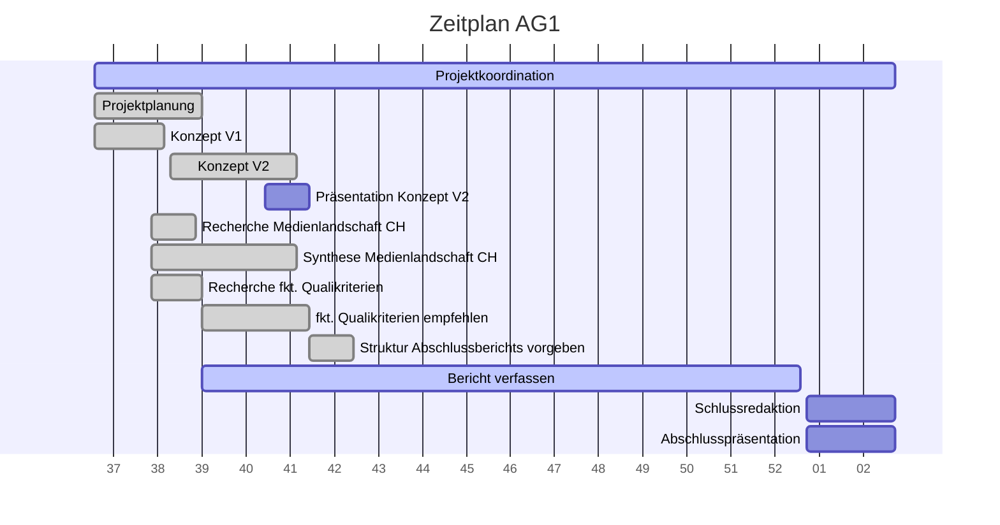

# Projektcontrolling AG 1: Projektleitung

Legende: \emoji{green-circle} on time | verzögert \emoji{yellow-circle} | kritisch \emoji{orange-circle} | zu spät \emoji{red-circle} | erledigt: \emoji{check-mark} | Milestone: \emoji{large-blue-diamond}

## Nächste Termine
<!-- erledigte Zeilen  hier einfügen 
| Termin | Lieferobjekt | Status |
| -------- | -------- | -------- | 
| Mo, 12.10. |Konzept V2 erstellen |\emoji{check-mark}| 
|Mo, 12.10.| \emoji{large-blue-diamond} Konzeptabgabe|\emoji{check-mark}|
|Mi, 14.10.2020| Präsentation erstellen |\emoji{check-mark}|
|Mi, 14.10.2020| \emoji{large-blue-diamond} MS Präsentation gehalten |\emoji{check-mark}|
|So, 18.10.2020 | Leistungsindikatoren in Zusammenarbeit mit AGs festlegen | \emoji{check-mark} |
|Sa, 31.10.2020 | Bereinigung Zotero | \emoji{check-mark} |
|10.11.20 | McQuail ausfindig machen |\emoji{check-mark}|
--> 

| Termin | Lieferobjekt | Status |
| -------- | -------- | -------- | 
|laufend | Projektcontrolling, allenfalls Massnahmen einleiten |\emoji{green-circle}|
|31.12.20 | Vergleich verschiedener Kriterienkataloge ausarbeiten |\emoji{check-mark}|
|15.01.21 | Schlussredaktion des Gesamtberichts | |

<!--  
## Statusbericht vom 18. Oktober

### Lieferobjekte in Arbeit

Erledigt: 
* Vorgaben Struktur Bericht
* Leistungsindikatoren Empfehlung

Sind wir dran: 
* Zotero bereinigen
* Vergleich McQuail, Arnold, Engesser
* Projektcontrolling

### Entscheidungen / Abklärungen
Fragen zu Leistungsindikatoren und Analyseeinheiten, auf Konzepte verwiesen. 
### Herausforderungen / Besonderes
Schwierig: Abgabe Codebuch von AG2, im Auge behalten

### Ausblick / Wie geht's weiter?
Massnahmen, falls Codebuch-Teile verspätet (Fertigstellung in Gefahr?)

# Statusbericht vom 1. November

## Erledigt: 
* McQuail bestellt, fraglich ob der rechtzeitig kommt

## Was zu entscheiden war: 
* Abklärung bei AGs, ob weniger Zeit für Verbesserung des Codebuchs V1 geht (Wunsch AG5 wegen Berechnung Test V1).
-->
<!--

## Statusbericht vom 15. November

### Lieferobjekte in Arbeit

Erledigt: 
* Bereinigungen Zotero

Sind wir dran: 
* Vergleich McQuail, Arnold, Engesser
* Projektcontrolling

### Entscheidungen / Abklärungen

*  Neu-Abstimmung Zeitplan mit AGs aufgrund Verzögerung Codierung

### Herausforderungen / Besonderes

* Es läuft reibungslos, die AGs leisten eine super Arbeit.

### Ausblick / Wie geht's weiter?

* Beobachten - bei Problemen vermitteln.
-->

## Statusbericht vom 29. November

### Lieferobjekte in Arbeit

Erledigt: 
* Zuständigkeitsfragen für Verbesserungen Codebuch klären; Rückfragen an Dahinden/Dalmus weiterleiten

Sind wir dran: 
* Vergleich McQuail, Arnold, Engesser
* Projektcontrolling

### Entscheidungen / Abklärungen

*  Zeitplan im Auge behalten für Codebuch V2

### Herausforderungen / Besonderes

* Es gab einige Unklarheiten, wie mit der Korrektur des Codebuchs vorzugehen ist und wer was wie tun soll.

### Ausblick / Wie geht's weiter?

* Beobachten - bei Problemen vermitteln.

## Individueller Zeitplan

## Übersicht Arbeitspakete

Legende: \emoji{green-circle}   on time | verzögert \emoji{yellow-circle} | kritisch \emoji{orange-circle} | zu spät \emoji{red-circle} | erledigt: \emoji{check-mark} | Milestone: \emoji{large-blue-diamond}

| Arbeitspaket | Zeitraum | Status |
| ------------ | ----------- | ----- |
| Projektkoordination | 13.09.2020 - 15.01.2021 |\emoji{green-circle}|
| Projektplanung Vorschlag | 13.09.2020 - 27.09.2020 |\emoji{check-mark} |
| Konzept Version 1 | 10.09.2020 - 21.09.2020 |\emoji{large-blue-diamond}\emoji{check-mark} |
| Überarbeitung der Planung mit AGs | 28.09.2020 - 12.10.2020 |\emoji{check-mark} |
| Recherche über die Medienlandschaft der Schweiz | 19.09.2020 - 07.10.2020 | \emoji{check-mark} |
| Text über die Medienlandschaft der Schweiz schreiben | 2020-09-19 - 2020-10-12|\emoji{check-mark} |
| Recherche zu den funktionalen Qualitätskriterien | 2020-09-19 - 2020-09-27| \emoji{check-mark} |
| Empfehlung funktionale Qualitätskriterien ausarbeiten und kommunizieren | 27.09.2020 - 14.10.2020 | \emoji{check-mark} |
| Konzept Version 2 zusammentragen | 22.09.2020 - 12.10.2020 | \emoji{large-blue-diamond}\emoji{check-mark} |
| Präsentation zu Konzept Version 2 erstellen | 07.10.2020 - 14.10.2020 | \emoji{check-mark}|
| Präsentation zu Konzept Version 2 halten | 14.10.2020 | \emoji{large-blue-diamond}\emoji{check-mark}|
| Leistungsindikatoren in Zusammenarbeit mit AGs festlegen | 12.10.2020 - 18.10.2020 |\emoji{check-mark}|
| Zotero bereinigen, Probleme mit Sharelatex beheben | 20.10.2020 - 31.10.2020 | \emoji{check-mark} |
| Vergleich verschiedener Kriterienkataloge ausarbeiten | 27.09.2020 - 31.12.2020 | \emoji{green-circle} |
| Bericht verfassen | 27.09.2020 - 31.12.2020 | \emoji{green-circle}
| Schlussredaktion des Gesamtberichts | 01.01.2021 - 15.01.2021 | 
| Gesamtbericht steht | 15.01.2021 | \emoji{large-blue-diamond}
| Abschlusspräsentation vorbereiten | 08.01.2021 - 15.01.2021 |
| Abschlusspräsentation halten | 15.01.2021 |\emoji{large-blue-diamond}
