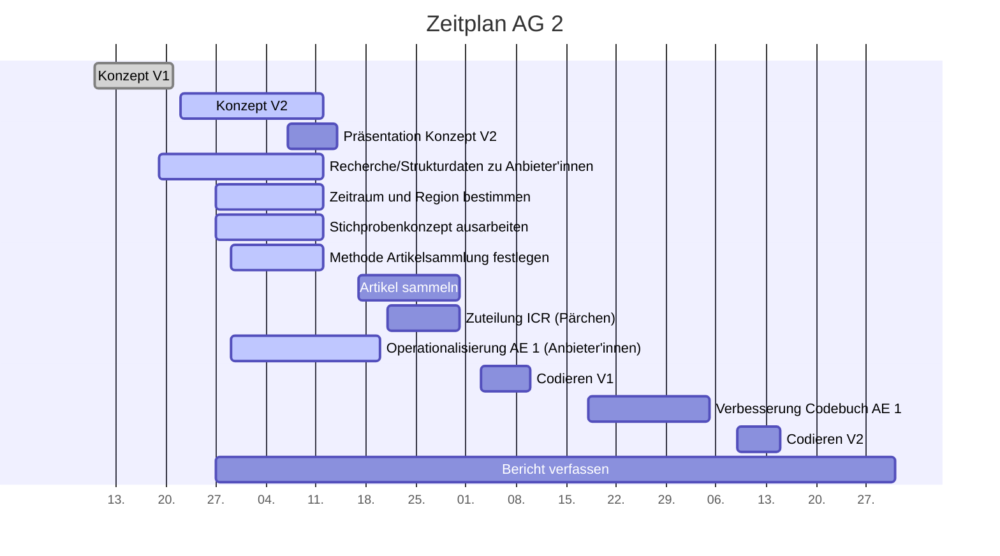

# Projektcontrolling AG 2: Rohdatensammlung

Legende:  on time 🟢 | verzögert 🟡 | kritisch 🟠 | zu spät 🔴 | erledigt: ✔️ | Milestone: 🔷

## Nächste Termine
<!-- erledigte Zeilen  hier einfügen 
| Termin | Lieferobjekt | Status |
| -------- | -------- | -------- | 
| Termin | Lieferobjekt | Status |
| -------- | -------- | -------- | 
| Mo, 12.10. |Konzept V2 erstellen |✔️| 
|Mo, 12.10.| 🔷; Konzeptabgabe| ✔️ |
|Mi, 14.10.| Präsentation erstellen |✔️|
|Mi, 14.10.| 🔷; MS Präsentation gehalten | ✔️ |
| Di, 20.10. |Codiereinheit Anbieter'innen |✔️ | 
| Do, 29.10. | Artikelsammlung | ✔️ |
| Freitag 13.11. | Codebuch v1 codieren |✔️ | 
| Montag 23.11. - Samstag 5.12. | Problemanalyse und Verbesserung Codebuch Anbieter'innen |✔️ | 
| Mittwoch 09.12. - Dienstag 15.12. | Codebuch v2 codieren |✔️ | 

--> 

| Termin | Lieferobjekt | Status |
| -------- | -------- | -------- | 
 |Donnerstag 7.1. | Abgabe Projektbericht |🟢 | 
<!--  NEUE ZEILEN OBEN REINKOPIEREN
Ihr könnt sie unten aus der Tabelle mit den Arbeitspaketen rauskopieren und oben einfügen
-->

<!-- falls Tabellen benötigt werden
| Column 1 | Column 2 | Column 3 |
| -------- | -------- | -------- |
| Text     | Text     | Text     |

-->

<!-- Bitte jeweils den neusten zuoberst einfügen -->
 ## Statusbericht vom 22. Dezember
### Lieferobjekte in Arbeit 
<!-- Was zu erledigen war. Wo ihr dran seid -->
 * Bericht schreiben
 

### Entscheidungen / Abklärungen
<!-- Was war zu entscheiden / abzuklären, mit wem.  -->

### Herausforderungen / Besonderes
<!-- speziell Erwähnenswertes | Abhängigkeiten von anderen AGs-->

### Ausblick / Wie geht es weiter?
<!-- Was kommt als nächstes? | kommende Arbeitspakete -->
* Für den Abschlussbericht sollten Hypothesen zur Fragestellung gebildet werden. 
* Die These 2 in unserem Bericht sollte auf Website-Ebene umformuliert werden.
* Der Schlussbericht sollte bis am 7. Januar 2021 fertiggeschrieben werden. 

<!--
 ## Statusbericht vom 13. Dezember
### Lieferobjekte in Arbeit 
 * Codierdurchgang 2 bis Dienstag 15.12.

### Entscheidungen / Abklärungen
* Einzelne Fragen zur Codierung (jeweils im CodiMD oder über Threema geklärt)

### Herausforderungen / Besonderes

### Ausblick / Wie geht es weiter?
* Für den Abschlussbericht sollten Hypothesen zur Fragestellung gebildet werden. 
* Die These 2 in unserem Bericht sollte auf Website-Ebene umformuliert werden.
* Der Schlussbericht sollte bis am 31. Dezember 2020 fertiggeschrieben werden.
-->

<!--## Statusbericht vom 29. November
### Lieferobjekte in Arbeit

<!-- 
* Artikelbenennung wurde auf Wunsch der AG 4 & 5 vereinheitlicht.
* Feedback des Codebuchs soweit umgesetzt. Einige Kategorien, die nichts mit den Forschungsfragen und Thesen zu tun hatten, auf Artikelebene abgefragt werden müssten od. keinen Erkenntnisgewinn brachten, wurden gelöscht. Die restlichen Kategorien wurden (falls schwache od. sehr schwache Übereinstimmung im ICR-Test) überarbeitet. Dazu wurden v.a. die Erklärungen und Beispiele verdeutlicht. 
* Das Codebuch der Website hat nun noch ca. 25 Kategorien. 
* Felder  0 / 77 / 99 wurden angepasst und eingetragen.

### Entscheidungen / Abklärungen
Entscheidung: Grosszügiges Löschen der Kategorien (Begründung s. oben)

### Herausforderungen / Besonderes

AG empfand Überarbeitung als schwierig, da keine Garantie, dass geänderte Kategorien den ICR-Test verbessern. 

### Ausblick / Wie geht's weiter?
* Codebuch mit Dahinden besprechen und ggf. nochmals überarbeiten 
* mit v2 Codieren
* Alle Änderungen, Besprechungen etc. stichwortartig in den Schlussbericht schreiben
* Schlussbericht bis zum 31.12. verfassen
-->

<!-- 
## Statusbericht vom 15. November
### Lieferobjekte in Arbeit
Abwarten auf Feedback der Codebuch v1

<!-- falls Tabellen benötigt werden
| Column 1 | Column 2 | Column 3 |
| -------- | -------- | -------- |
| Text     | Text     | Text     |

### Entscheidungen / Abklärungen
\-\-\-\-\-\-

### Herausforderungen/Besonderes

\-\-\-\-\-\-

### Ausblick / Wie geht's weiter?
* Codebuch ausbessern 
* mit v2 Codieren
* immer alles mögliche in den Schlussbericht schreiben
* Schlussbericht bis 31.12. verfassen
-->

<!-- ## Statusbericht vom 25. Oktober
### Lieferobjekte in Arbeit

1. Artikel sammeln
2. Zuteilung ICR (Pärchen)

### Entscheidungen / Abklärungen

Abklären mit AG 4: Brauchen sie bereits vorher Artikel.

### Herausforderungen/Besonderes
Eine Zeitung hat seit einem Monat nichts mehr publiziert, obwohl es eigentlich eine Wochenzeitung wäre... Wir warten bis Di ab und müssen sonst notfalls "alte" Artikel sammeln, die eigentlich gar nicht im Untersuchungszeitraum liegen. 

### Ausblick / Wie geht's weiter?
Bis am Donnerstag sollten alle Artikel gesammelt werden. Da fehlen noch ca. 4 Plattformen, sollte also gehen.
Beim Sammeln der Artikel wurde bereits eine Grobeinteilung in Schichten vorgenommen, diese muss noch finalisiert werden. Aus den Schichten wird dann die Zufallsauswahl getroffen. 
Danach erfolgt die Zuteilung der Artikel zu den Codierer'innen.

-->
----
## Individueller Zeitplan

----
## Übersicht Arbeitspakete AG2
<!-- erledigte Zeilen löschen oder abhaken: ✔️ -->

Legende: 🟢 on time | verzögert 🟡 | kritisch 🟠 | zu spät 🔴 | erledigt: ✔️ | Milestone: 🔷

| Arbeitspaket | Zeitfenster | Status |
| ------------ | ----------- | ----- |
| Konzept Version 1 | 13.09.2020 - 21.09.2020 |✔️ |
| Recherche/Strukturdaten zu Anbieter'innen sammeln (Liste zusammenstellen)| 19.09.2020 - 12.10.2020 |✔️|
| Zu untersuchenden Zeitraum und Region bestimmen| 27.09.2020 - 12.10.2020| ✔️|
| Methode zur Sammlung der Artikel festlegen| 29.09.2020 - 12.10.2020| ✔️|
| Konzept Version 2 zusammentragen| 22.09.2020 - 12.10.2020 | ✔️ 🔷|
| Präsentation zu Konzept Version 2 erstellen | 2020-10-07, 2020-10-14| ✔️ |
| Präsentation zu Konzept Version 2 halten | 14.10.2020 | ✔️ 🔷
|Operationalisierung der Analyseeinheit 1 (Anbieter'innen) | 29.09.2020 - 20.10.2020| ✔️ 🔷 |
| Artikel sammeln | 16.10.2020 - 29.10.2020| ✔️ 🔷 |
| Zuteilung für ICR (Pärchenbildung, Artikelzuteilung - Absprache mit AG2) | 21.10.2020 - 31.10.2020 | ✔️  |
| Codierschulungsteil vorbereiten | 27.10.2020 - 03.11.2020 | ✔️ 
| Codierschulung für eigenen Teil durchführen | 03.11.2020 | ✔️ 🔷|
|Codieren mit Codebuch V1 | 03.11.2020 - 10.11.2020|✔️ |
|Verbesserung des eigenen Codebuch-Teils (Anbieter'innen) | 18.11.2020 - 05.12.2020|✔️ |
|Codieren mit Codebuch V2| 09.12.2020 - 15.12.2020|✔️ |
|Bericht verfassen| 27.09.2020 - 31.12.2020| 🔷 |

----

----