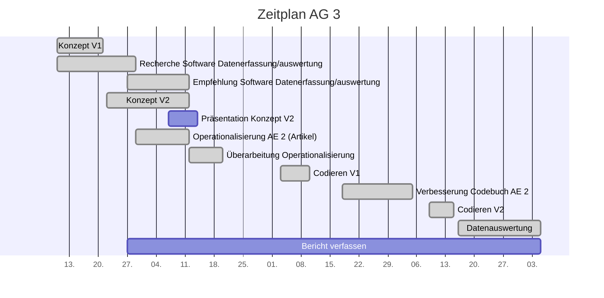

# Projektcontrolling AG 3: Datenmanagement

Legende: 🟢 on time | verzögert 🟡 | kritisch 🟠 | zu spät 🔴 | erledigt: ✔️ | Milestone: 🔷

## Nächste Termine
<!-- erledigte Zeilen  hier einfügen 
| Termin | Lieferobjekt | Status |
| -------- | -------- | -------- | 

-->

| Termin | Lieferobjekt | Status |
| -------- | -------- | -------- |
|Do, 07.01 | Bericht verfassen | 🟢 |
|So, 27.12. | Datenauswertung |✔️| 
|Di, 15.12.| Codieren mit Codebuch V2 |✔️ |
| Sa, 05.12. | Verbesserung des eigenen Codebuch-Teils (Artikel)| ✔️ | 
|Di, 13.11.| Codieren mit Codebuch V1|✔️ |
|Di, 20.10.| 🔷 Operationalisierung der Analyseeinheit 2 (Artikel) |✔️ |
|Mo, 12.10.| Konzept V2 erstellen |✔️| 
|Mo, 12.10.| 🔷 Konzeptabgabe|✔️|
|Mi, 14.10.| Präsentation erstellen |✔️|
|Mi, 14.10.| 🔷 MS Präsentation gehalten |✔️|
<!--  NEUE ZEILEN OBEN REINKOPIEREN
Ihr könnt sie unten aus der Tabelle mit den Arbeitspaketen rauskopieren und oben einfügen; die Idee wär, dass "alte" Daten oben rausfliegen, und neue unten "nachrücken". der 20. wäre also unten sinnvoller, aber Merci pour l'effort! 
-->
## Statusbericht vom 03. Januar
### Lieferobjekte in Arbeit

<!-- Was zu erledigen war. Wo ihr dran seid -->
Es wird fleissig am Schlussbericht gearbeitet. Bis am Donnerstag wird daran fertig geschrieben, danach wird die Präsentation erstellt.

<!-- falls Tabellen benötigt werden
| Column 1 | Column 2 | Column 3 |
| -------- | -------- | -------- |
| Text     | Text     | Text     |

-->
### Entscheidungen / Abklärungen
<!-- Was war zu entscheiden / abzuklären, mit wem.  -->
Es hat noch ein paar Rückfragen zu den Datenauswertungen gegeben, die wir an die AGs versendet hatten. Die Unklarheiten/Fehler konnten inzwischen alle beseitigt werden.

### Herausforderungen/Besonderes
<!-- speziell Erwähnenswertes | Abhängigkeiten von anderen AGs-->
Die vorgegebene Struktur des Schlussberichts sinnvoll zu füllen ist schwierig.

### Ausblick / Wie geht's weiter?
<!-- Was kommt als nächstes? | kommende Arbeitspakete -->
Nach dem Bericht wird an der Präsentation gearbeitet.

----
## Statusbericht vom 27. Dezember
### Lieferobjekte in Arbeit

<!-- Was zu erledigen war. Wo ihr dran seid -->
Die Grafiken zu den Datenauswertungen werden heute Abend an alle Arbeitsgruppen verschickt.
Danach wird weiter am Bericht gearbeitet.

<!-- falls Tabellen benötigt werden
| Column 1 | Column 2 | Column 3 |
| -------- | -------- | -------- |
| Text     | Text     | Text     |

-->
### Entscheidungen / Abklärungen
<!-- Was war zu entscheiden / abzuklären, mit wem.  -->
Keine

### Herausforderungen/Besonderes
<!-- speziell Erwähnenswertes | Abhängigkeiten von anderen AGs-->
Die Daten konnte nicht wie geplant ausgewertet werden. Aufgrund der zum Teil (insbesondere auf der Ebene Statement und Akteur) fehlenden Datensätze konnten keine Grafiken erstellt werden und keine Daten ausgewertet werden.
### Ausblick / Wie geht's weiter?
<!-- Was kommt als nächstes? | kommende Arbeitspakete -->
Der Bericht muss fertig verfasst werden. Danach muss die Präsentation erstellt werden.

----
## Statusbericht vom 20. Dezember
### Lieferobjekte in Arbeit

<!-- Was zu erledigen war. Wo ihr dran seid -->
Im Moment wird an der Datenauswertung gearbeitet. Die Auswertungen werden von den Teammitgliedern vorbereitet und am Montag besprochen. Danach werden die definitiven Auswertungen gemacht und allen geschickt.
Zeitgleich wird auch am Schlussbericht gearbeitet.

<!-- falls Tabellen benötigt werden
| Column 1 | Column 2 | Column 3 |
| -------- | -------- | -------- |
| Text     | Text     | Text     |

-->
### Entscheidungen / Abklärungen
<!-- Was war zu entscheiden / abzuklären, mit wem.  -->
Keine

### Herausforderungen/Besonderes
<!-- speziell Erwähnenswertes | Abhängigkeiten von anderen AGs-->
Keine
### Ausblick / Wie geht's weiter?
<!-- Was kommt als nächstes? | kommende Arbeitspakete -->
Die Auswertung muss abgeschlossen werden und der Bericht fertig verfasst werden.

----
## Statusbericht vom 13. Dezember
### Lieferobjekte in Arbeit

<!-- Was zu erledigen war. Wo ihr dran seid -->
Es wird weiterhin mit dem Codebuch V2 codiert. Die Arbeitsgruppen haben von uns den Auftrag erhalten, die Messkonstrukte zu überprüfen und Rückmeldung zu geben, falls Änderungen gewünscht sind.

<!-- falls Tabellen benötigt werden
| Column 1 | Column 2 | Column 3 |
| -------- | -------- | -------- |
| Text     | Text     | Text     |

-->
### Entscheidungen / Abklärungen
<!-- Was war zu entscheiden / abzuklären, mit wem.  -->
Die Terminplanung wurde geändert und wir starten jetzt früher mit der Datenauswertung (zeitgleich wie ICR).

### Herausforderungen/Besonderes
<!-- speziell Erwähnenswertes | Abhängigkeiten von anderen AGs-->
Aufgrund der geänderten Terminplanung haben wir nicht mehr so lange Zeit, um die Daten auszuwerten. Wir müssen viel leisten innheralb kürzester Zeit.

### Ausblick / Wie geht's weiter?
<!-- Was kommt als nächstes? | kommende Arbeitspakete -->
Nach der Codierung startet unserer Datenauswertung. Danach sollte intensiv am Schlussbericht gearbeitet werden.

----
## Statusbericht vom 06. Dezember
### Lieferobjekte in Arbeit

<!-- Was zu erledigen war. Wo ihr dran seid -->
Die Hypothesen der einzelnen Arbeitsgruppen werden heute noch zusammengetragen. Die Messkonstrukte zu den Hypothesen werden ebenfalls noch in nächster Zeit erarbeitet.

<!-- falls Tabellen benötigt werden
| Column 1 | Column 2 | Column 3 |
| -------- | -------- | -------- |
| Text     | Text     | Text     |

-->
### Entscheidungen / Abklärungen
<!-- Was war zu entscheiden / abzuklären, mit wem.  -->
Es müssen noch diverse Rückfragen geklärt werden mit den Arbeitsgruppen betreffend der Hypothesen.
Diese haben auch Einfluss auf die Messkonstrukte, die wir erstellen werden.

### Herausforderungen/Besonderes
<!-- speziell Erwähnenswertes | Abhängigkeiten von anderen AGs-->
Es sind viele Auswertungen, die wir an die einzelnen Arbeitsgruppen abliefern müssen. Die Herausforderung wird sein, die Auswertung mit SPSS zu bewältigen (es braucht sehr viel Einarbeitungszeit, um mit dem Tool umgehen zu können).

### Ausblick / Wie geht's weiter?
<!-- Was kommt als nächstes? | kommende Arbeitspakete -->
Bis heute Abend werden alle Änderungen, die das Codebuch V2 betreffen noch der AG3 mitgeteilt.
Nach der Fertigstellung des Codebuches werden wir anfangen unsere Aritkel zu codieren. Danach folgt die Datenauswertung.

----
## Statusbericht vom 29. November
### Lieferobjekte in Arbeit

<!-- Was zu erledigen war. Wo ihr dran seid -->
Am Montag werden in einer Gruppensitzung die Änderungen für das Codebuch besprochen.

<!-- falls Tabellen benötigt werden
| Column 1 | Column 2 | Column 3 |
| -------- | -------- | -------- |
| Text     | Text     | Text     |

-->
### Entscheidungen / Abklärungen
<!-- Was war zu entscheiden / abzuklären, mit wem.  -->
Am Dienstag wird der AG2 mitgeteilt, welche Kategorien wir aus dem Codebuch entfernt haben und welche nicht, damit es keine Überschneidungen mehr zwischen unseren Kategorien gibt.

### Herausforderungen/Besonderes
<!-- speziell Erwähnenswertes | Abhängigkeiten von anderen AGs-->
Keine Herausforderungen

### Ausblick / Wie geht's weiter?
<!-- Was kommt als nächstes? | kommende Arbeitspakete -->
Wir werden bis am Dienstag unseren Teil des Codebuches verbessern. Danach werden wir mit dem Codebuch V2 codieren.

----
## Statusbericht vom 22. November
### Lieferobjekte in Arbeit

<!-- Was zu erledigen war. Wo ihr dran seid -->
Im Moment wird die Datenauswertung vorbereitet.

<!-- falls Tabellen benötigt werden
| Column 1 | Column 2 | Column 3 |
| -------- | -------- | -------- |
| Text     | Text     | Text     |

-->
### Entscheidungen / Abklärungen
<!-- Was war zu entscheiden / abzuklären, mit wem.  -->
Es sind keine Entscheidungen/Abklärungen notwendig
Offene Frage die evtl. aber noch geklärt werden muss: Erhalten wir die Datensätze nach der Coderiung der V2 zusammengetragen in einem Excel?

### Herausforderungen/Besonderes
<!-- speziell Erwähnenswertes | Abhängigkeiten von anderen AGs-->
Keine Herausforderungen

### Ausblick / Wie geht's weiter?
<!-- Was kommt als nächstes? | kommende Arbeitspakete -->
Wir beschäftigen uns weiterhin laufend mit der Datenauswertung. Als nächsten Schritt werden wir dann bis am 05.12. noch unseren Teil des Codebuches verbessern. 

----
## Statusbericht vom 15. November
### Lieferobjekte in Arbeit

<!-- Was zu erledigen war. Wo ihr dran seid -->
Bis am Freitag haben alle Gruppenmitglieder ihre Artikel und eine Website codiert. Im Moment wird an der Auswertung gearbeitet: Die Messkonstrukte für die Hypothesen wurden herausgearbeitet und an die Projektmitglieder gesendet. Zudem werden bereits jetzt erste Versuche in SPSS gemacht.

<!-- falls Tabellen benötigt werden
| Column 1 | Column 2 | Column 3 |
| -------- | -------- | -------- |
| Text     | Text     | Text     |

-->
### Entscheidungen / Abklärungen
<!-- Was war zu entscheiden / abzuklären, mit wem.  -->
Im Moment waren keine Entscheidungen/Abklärungen notwendig

### Herausforderungen/Besonderes
<!-- speziell Erwähnenswertes | Abhängigkeiten von anderen AGs-->
Einige Hypothesen decken keine Kategorien ab. Die Hypothesen oder das Codebuch V2 muss deshalb auch in Hinblick auf die Auswertung angepasst werden.

### Ausblick / Wie geht's weiter?
<!-- Was kommt als nächstes? | kommende Arbeitspakete -->
Wir beschäftigen uns weiterhin laufend mit der Datenauswertung. Als nächsten Schritt werden wir dann bis am 05.12. noch unseren Teil des Codebuches verbessern. 

----
## Statusbericht vom 08. November
### Lieferobjekte in Arbeit

<!-- Was zu erledigen war. Wo ihr dran seid -->
Die Codierschulung wurde vorbereitet und unser Teil des Codebuches wurde an der Codierschulung vorgestellt. Nach der Codierschulung sind noch einige Änderungen angefallen, die für die Version 1 an die AG4 mitgeteilt wurden.
Im Moment sind alle Mitglieder der Gruppe dran, die 10 Aritkel und 1 Website zu codieren.
Ausserdem wird immer noch laufend an der Vorbereitung der Auswertung gearbeitet.

<!-- falls Tabellen benötigt werden
| Column 1 | Column 2 | Column 3 |
| -------- | -------- | -------- |
| Text     | Text     | Text     |

-->
### Entscheidungen / Abklärungen
<!-- Was war zu entscheiden / abzuklären, mit wem.  -->
Im Moment waren keine Entscheidungen/Abklärungen notwendig

### Herausforderungen/Besonderes
<!-- speziell Erwähnenswertes | Abhängigkeiten von anderen AGs-->
Die Codierung der Artikel und der Website gestaltet sich als schwierig und ist sehr zeitaufwendig.

### Ausblick / Wie geht's weiter?
<!-- Was kommt als nächstes? | kommende Arbeitspakete -->
Als nächstes werden bis am Freitag, 13.11. die Artikel und die Website codiert. Dann werden wir uns intensiv um die Vorbereitung der Datenauswertung kümmern, bevor wir unseren Teil des Codebuches anpassen werden für die Version 2.

----
<!-- Bitte jeweils den neusten zuoberst einfügen -->
## Statusbericht vom 01. November
### Lieferobjekte in Arbeit

<!-- Was zu erledigen war. Wo ihr dran seid -->
Die Feedback-Vorschläge von Dalmus und Dahinden zum Codebuch V1 wurden geprüft und Änderungswünsche wurden der AG4 mitgeteilt.

Es wurden erste Vorarbeiten betreffend Datenauswertung gemacht. Dazu wurden die Hypothesen von allen Arbeitsgruppen angeschaut und versucht aufzulisten, welche Ausprägungen für die Falsifizierung oder Verifizierung der Hypothese benötigt werden.

<!-- falls Tabellen benötigt werden
| Column 1 | Column 2 | Column 3 |
| -------- | -------- | -------- |
| Text     | Text     | Text     |

-->
### Entscheidungen / Abklärungen
<!-- Was war zu entscheiden / abzuklären, mit wem.  -->
Im Moment waren keine Entscheidungen/Abklärungen notwendig

### Herausforderungen/Besonderes
<!-- speziell Erwähnenswertes | Abhängigkeiten von anderen AGs-->
Die Datenauswertung stellt sich im Moment als schwierig heraus
### Ausblick / Wie geht's weiter?
<!-- Was kommt als nächstes? | kommende Arbeitspakete -->
Als nächstes wird am 02.11. in der Gruppe besprochen, wie unser Teil der Codierschulung aussehen wird. Am 03.11. findet dann die Codierschulung statt und ab dann wird mit dem Codebuch V1 codiert.

----
<!-- Bitte jeweils den neusten zuoberst einfügen -->
## Statusbericht vom 25. Oktober
### Lieferobjekte in Arbeit

<!-- Was zu erledigen war. Wo ihr dran seid -->
Unser Teil des Codebuches wurde an die AG4 weitergeleitet
Unsere Hypothesen und Forschungsfragen wurden an die AG4 mitgeteilt
Nach dem ersten Feeback der AG4 müssen evtl. noch ein paar Anpassungen gemacht werden und Entscheidungen/Abklärungen getroffen werden

<!-- falls Tabellen benötigt werden
| Column 1 | Column 2 | Column 3 |
| -------- | -------- | -------- |
| Text     | Text     | Text     |

-->
### Entscheidungen / Abklärungen
<!-- Was war zu entscheiden / abzuklären, mit wem.  -->
Im Moment waren keine Entscheidungen/Abklärungen notwendig

### Herausforderungen/Besonderes
<!-- speziell Erwähnenswertes | Abhängigkeiten von anderen AGs-->
Im Moment keine Herausforderungen

### Ausblick / Wie geht's weiter?
<!-- Was kommt als nächstes? | kommende Arbeitspakete -->
Als nächstes wird ab dem 03.11. mit dem Codebuch V1 codiert

----
## Statusbericht vom 18. Oktober
### Lieferobjekte in Arbeit

<!-- Was zu erledigen war. Wo ihr dran seid -->
Erste Version unseres Codebuch-Teils wurde erstellt
Erstes Test-Codieren von 3 Artikeln bis am 19.10.20
Besprechung und Endfassung Codebuchteil V1 am 19.10.20
Abgabe Codebuchteil V1 an AG4 bis am 20.10.20

<!-- falls Tabellen benötigt werden
| Column 1 | Column 2 | Column 3 |
| -------- | -------- | -------- |
| Text     | Text     | Text     |

-->

### Entscheidungen / Abklärungen
<!-- Was war zu entscheiden / abzuklären, mit wem.  -->
Entscheid Codebuch:
Folgende (von der PL vorgeschlagene) Leistungskategorien werden nicht von uns abgedeckt:
Attraktivität (betrifft unserer Meinung nach Ebene Website)
Objektivität (betrifft unserer Meinung nach Ebene Statement )
Vielfalt (betrifft unserer Meinung nach Ebene Website, Akteure und Statement)
Interaktivität ist noch offen, je nach Antwort von AG2

Folgende Anfrage haben wir an AG2 versendet:
1) Habt ihr evtl. ein Beispiel-Artikel, den ihr uns zusenden könntet? Wir müssten wissen, ob die Artikel mit Kommentaren/Bewertungen etc. geschickt werden.
2) Welche Medien sind aktuell in der Auswahl? Es hat ja noch Änderungen gegeben von eurer Auflistung in eurem Konzept. Und auf die Präsentation haben wir ja blöderweise keinen Zugriff, damit wir nachschauen könnten...
3) Welche Ressort-Bezeichnungen gibt es alle? Habt ihr da eine Auflistung?

### Herausforderungen/Besonderes
<!-- speziell Erwähnenswertes | Abhängigkeiten von anderen AGs-->
siehe oben: Antwort von AG2 noch ausstehend, hat Einfluss auf unseren Teil des Codebuches

### Ausblick / Wie geht's weiter?
<!-- Was kommt als nächstes? | kommende Arbeitspakete -->
siehe oben: das Codebuch fertigstellen und an AG4 versenden

----
## Individueller Zeitplan
<!-- Dieses GANTT haben wir mit [mermaid](https://pad.gwdg.de/features?both#Mermaid) erstellt.-->

----

## Übersicht Arbeitspakete
<!-- erledigte Zeilen löschen oder abhaken: ✔️ -->

Legende: 🟢 on time | verzögert 🟡 | kritisch 🟠 | zu spät 🔴 | erledigt: ✔️ | Milestone: 🔷

| Arbeitspaket | Zeitraum | Status |
| ------------ | ----------- | ----- |
| Konzept Version 1 | 13.09.2020 - 21.09.2020 |✔️|
| Recherche Software für Erfassung und Auswertung der Daten | 10.09.2020 - 29.09.2020 |✔️|
| Empfehlung Software für Erfassung und Auswertung der Daten | 29.09.2020 - 12.10.2020 |✔️| 
| Konzept Version 2 zusammentragen| 22.09.2020 - 12.10.2020 |🔷✔️|
| Präsentation zu Konzept Version 2 erstellen | 07.10.2020 - 14.10.2020| ✔️|
| Präsentation zu Konzept Version 2 halten | 14.10.2020 |🔷✔️
|Operationalisierung der Analyseeinheit 2 (Artikel) | 29.09.2020 - 20.10.2020|🔷✔️ |
| Codierschulungsteil vorbereiten | 27.10.2020 - 03.11.2020 | ✔️
| Codierschulung für eigenen Teil durchführen | 03.11.2020 | 🔷✔️|
|Codieren mit Codebuch V1 | 06.11.2020 - 13.11.2020|✔️ |
|Verbesserung des eigenen Codebuch-Teils (Artikel) | 23.11.2020 - 05.12.2020|✔️ |
|Codieren mit Codebuch V2| 09.12.2020 - 15.12.2020 |✔️ |
| Datenauswertung (inhaltliche Analyse) Codierung V2 |  16.12.2020 - 27.12.2021 |✔️ |
|Bericht verfassen| 27.09.2020 - 07.01.2021|🔷 |

----