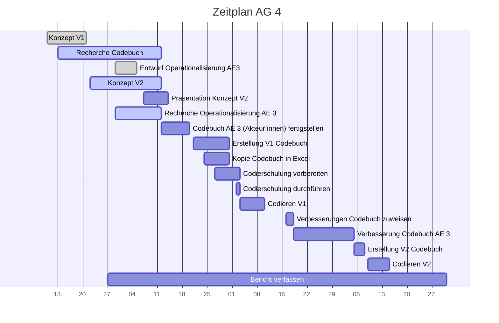

# Projektcontrolling AG 4: Codebuchentwicklung

Legende: 🟢 on time | verzögert 🟡 | kritisch 🟠 | zu spät 🔴 | erledigt: ✔️ | Milestone: 🔷

## Nächste Termine

<!-- erledigte Zeilen  hier einfügen 
| Termin | Lieferobjekt | Status |
| Operationalisierung der Analyseeinheit 3 finalisieren (Akteur'innen) | 20.10.2020|🔷 🟢 
| Raster für Datenerfassung erstellen | 23.10.2020 | 🟢 |
| Übertragung des Codebuchs in Raster für Codierung V1 | 31.10.2020  |🟢
| Codierschulung für AG2-5 vorbereiten | 03.11.2020 | 🟢
| Codierschulung für AG2-5 durchführen | 03.11.2020 | 🔷🟢|
| Codieren mit Codebuch V1 | 06.11.2020 - 13.11.2020| 🟢|
| Zuweisung der zu verbessernden Teil-Codebücher an AGs | 22.11.2020|🟢|
| Verbesserung des eigenen Codebuch-Teils (Akteur'innen) | 23.11.2020 - 06.12.2020| |
| Zusammenführung Version 2 des Codebuchs | 06.12.2020 - 08.12.2020| 🔷|
| Codieren mit Codebuch V2| 09.12.2020 - 15.12.2020  |🟢 |
-->

| Lieferobjekt | Termin | Status |
| -------- | -------- | -------- | 
| Bericht verfassen| 27.09.2020 - 07.01.2020|🟢 |

<!--  NEUE ZEILEN OBEN REINKOPIEREN
Ihr könnt sie unten aus der Tabelle mit den Arbeitspaketen rauskopieren und oben einfügen
-->

## Statusbericht vom 3. Januar
### Lieferobjekte in Arbeit
* Schlussbericht

### Entscheidungen / Abklärungen
* Probleme mit der Auswertung von These 3 und 4. Fehlerhafte Tabellen/Diagramme wurden vermutet. Abklärungen mit AG3 waren notwendig. 

### Herausforderungen/Besonderes
<!-- speziell Erwähnenswertes | Abhängigkeiten von anderen AGs-->
* Berichte der AGs alle sehr unterschiedlich. Jede AG macht "ihr eigenes Ding".

### Ausblick / Wie geht's weiter?
<!-- Was kommt als nächstes? | kommende Arbeitspakete -->
* Schreiben des Schlussberichtes bis zum 7.1.21

---

## Statusbericht vom 27. Dezember
### Lieferobjekte in Arbeit
* Schlussbericht

### Entscheidungen / Abklärungen
--

### Herausforderungen/Besonderes
<!-- speziell Erwähnenswertes | Abhängigkeiten von anderen AGs-->
* 2 von 4 Thesen können nicht ausgewertet werden, da es zu den Online-Only Medien zu wenige Datensätze gibt (Thesen 8 und 9 zu den politischen Akteur'innen). 

### Ausblick / Wie geht's weiter?
<!-- Was kommt als nächstes? | kommende Arbeitspakete -->
* Schreiben des Schlussberichtes bis zum 7.1.21

---

## Statusbericht vom 20. Dezember
### Lieferobjekte in Arbeit
* Schlussbericht

### Entscheidungen / Abklärungen
* Diverse Fragen zum Schlussbericht wurden von der PL geklärt. Die Struktur wurde entsprechend angepasst.
* Ein Sharelatex-Webinar wurde besucht. Auch hier konnten die Fragen geklärt werden.

### Herausforderungen/Besonderes
<!-- speziell Erwähnenswertes | Abhängigkeiten von anderen AGs-->

--

### Ausblick / Wie geht's weiter?
<!-- Was kommt als nächstes? | kommende Arbeitspakete -->
* Warten auf die Ergebnisse des ICR-Tests und die Datenauswertung.
* Schreiben des Schlussberichtes bis zum 7.1.21

---

## Statusbericht vom 13. Dezember
### Lieferobjekte in Arbeit
* Schlussbericht

### Entscheidungen / Abklärungen
* Bis am 15.12 müssen die Messkonstrukte und Lieferobjekte für die Auswertung festgelegt werden (Schnittstelle zu AG3)

### Herausforderungen/Besonderes
<!-- speziell Erwähnenswertes | Abhängigkeiten von anderen AGs-->

--

### Ausblick / Wie geht's weiter?
<!-- Was kommt als nächstes? | kommende Arbeitspakete -->
* Schreiben des Schlussberichtes bis zum 8.1.21

---

## Statusbericht vom 06. Dezember
### Lieferobjekte in Arbeit
* Fertigstellung Codebuch und Codebogen bis 8.12.

### Entscheidungen / Abklärungen
<!-- Was war zu entscheiden / abzuklären, mit wem.  -->
* Die Akteursdefinition wurde angepasst. Neu werden nur noch Personen als Akteur'innen erfasst, die direkt oder indirekt zu Wort kommen (mit Fr. Dalmus abgesprochen).
* Die Kategorien im Teilcodebuch wurde stark überarbeitet, da die ICR-Ergebnisse schlecht waren. Diverse unnötige Kategorien wurden gelöscht und für die Erfassung der Akteursrelevanz wurde eine neue Kategorie geschaffen. 
* Mit AG3 wurde geklärt, wie die Hypothesen ausgewerten werden sollen.
* Mit AG5 wurde entschieden, dass, falls keine Akteur'innen oder Statements vorhanden sind, im Codebogen gar nichts erfasst wird. Man kann direkt zum nächsten Artikel bzw. Akteur springen. Dadurch wird der Codierprozess vereinfacht.

### Herausforderungen/Besonderes
<!-- speziell Erwähnenswertes | Abhängigkeiten von anderen AGs-->
* Die Interpretation der ICR-Ergebnisse war schwierig, da nur wenige Daten vorlagen. Wir haben bei einer Kategorie die "Rotdaten" bestellt, um die Testergebnisse besser verstehen und die Kategorien gezielt optimieren zu können.
* Obwohl wir möglichst wenig in die Teilcodebücher der anderen eingreifen sollten, mussten wir oft Rückfragen stellen und Änderungsvorschläge machen, damit es eine gewisse Konsistenz im Codebuch geben konnte.

### Ausblick / Wie geht's weiter?
<!-- Was kommt als nächstes? | kommende Arbeitspakete -->
* Codierphase ab 9.12
* Schreiben des Berichtes

---

## Statusbericht vom 29. November
### Ausblick / Wie geht's weiter?
<!-- Was kommt als nächstes? | kommende Arbeitspakete -->
* Verbesserung des eigenen Teilcodebuches bis 6.12 und anschliessende Zusammenführung der Teilcodebücher.

## Statusbericht vom 22. November
### Ausblick / Wie geht's weiter?
<!-- Was kommt als nächstes? | kommende Arbeitspakete -->
* Verbesserung des eigenen Teilcodebuches bis 6.12 und anschliessende Zusammenführung der Teilcodebücher.

### Entscheidungen / Abklärungen
<!-- Was war zu entscheiden / abzuklären, mit wem.  -->
* Mail an Fr. Dalmus:
    * Dürfen Zellen in Codebogen leer bleiben, damit der Codierprozess beschleunigt werden kann? (wurde an der letzten Sitzung besprochen). AG5 und AG4 haben das nicht gleich verstanden. Mail an Fr. Dalmus am 22.11.20
    * Problem mit Unterscheidung der Codes 0 / 77 / 99. Bitte um Inputs.
---

## Statusbericht vom 15. November
### Ausblick / Wie geht's weiter?
<!-- Was kommt als nächstes? | kommende Arbeitspakete -->
* ICR-Ergebnisse abwarten und Teilcodebuch verbessern.
* Kategorien und Thesen in Hinblick auf die Auswertung kontrollieren (Mail vom 9.11.20 der AG3)

---

## Statusbericht vom 8. November
### Lieferobjekte in Arbeit
--
### Entscheidungen / Abklärungen
<!-- Was war zu entscheiden / abzuklären, mit wem.  -->
* Wie genau soll das "Zuweisung der zu verbessernden Teil-Codebücher an AGs" ablaufen? 
Idee: die AGs erhalten wieder das aktuellste docx-File von der AG4 und ändern ihren Teil anhand der Ergebnisse vom ICR-Test und den gesammelten Fragen ab. 
Es kann davon ausgegangen werden, dass alle Codebücher angepasst werden müssen. 

### Herausforderungen/Besonderes
<!-- speziell Erwähnenswertes | Abhängigkeiten von anderen AGs-->
* Codiervorgang: wie zählt man die Wörter bei einem png?
* Die Definition eines Akteurs/einer Akteurin wird voraussichtlich eine Knacknuss. Die Codierer'innen haben Schwierigkeiten mit der aktuellen Definition (gemäss Fragensammlung).
* Die Überarbeitung des Codebuches wird wahrscheinlich noch einmal viel Arbeit mit sich bringen.

### Ausblick / Wie geht's weiter?
<!-- Was kommt als nächstes? | kommende Arbeitspakete -->
* Codierphase abschliessen. Testergebnisse abwarten.

---

## Statusbericht vom 1. November
### Lieferobjekte in Arbeit
--
### Entscheidungen / Abklärungen
<!-- Was war zu entscheiden / abzuklären, mit wem.  -->
* Wie und an wen werden die ausgefüllten Codebogen abgegeben? Soll an Codierschulung mitgeteilt werden. AG5 klärt intern ab und teilt mit.

### Herausforderungen/Besonderes
<!-- speziell Erwähnenswertes | Abhängigkeiten von anderen AGs-->
* Am 3.11 ist die Codierschulung. Wahrscheinlich kommen noch "Probleme" zum Vorschein. Die Codierphase beginnt aber gemäss Planung sofort. Falls dringende Anpassungen in Codebuch/Codebogen nötig sind, kann die Codierphase frühestens am Do, 5. November beginnen, damit wir am Mittwoch Abend die Dokumente noch aktualisieren können.
### Ausblick / Wie geht's weiter?
<!-- Was kommt als nächstes? | kommende Arbeitspakete -->
* Codierschulung vom 3.11 ist nächster Meilenstein.

----
<!-- Bitte jeweils den neusten zuoberst einfügen -->

## Statusbericht vom 25. Oktober
### Lieferobjekte in Arbeit

<!-- Was zu erledigen war. Wo ihr dran seid -->
- Digitaler Codebogen bis 26.10.20 erstellen (Zuständig:Tamara) -> Entwurf an Dozierende schicken
- Codebuch bis 26.10.20 fertigstellen -> Entwurf an Dozierende schicken (Zuständig: Jo/Sandra)
- Codierschulung vorbereiten + Durchführen (Zuständig: Stefanie) -> Konzept am 26.10 an Dozierende schicken

<!-- falls Tabellen benötigt werden
| Column 1 | Column 2 | Column 3 |
| -------- | -------- | -------- |
| Text     | Text     | Text     |

-->
### Entscheidungen / Abklärungen
<!-- Was war zu entscheiden / abzuklären, mit wem.  -->
* Wo ist die Zuteilung der Artikel/Websites zu den Codierern ersichtlich? In einem weiteren Tabellenblatt im Codebogen? In Abklärung...
### Herausforderungen/Besonderes
<!-- speziell Erwähnenswertes | Abhängigkeiten von anderen AGs-->
* Am 3.11 ist die Codierschulung. Wahrscheinlich kommen noch "Probleme" zum Vorschein. Die Codierphase beginnt aber gemäss Planung sofort. Falls viele Anpassungen nötig sind, muss die Codierphase ev. 1-2 Tage herausgeschoben werden, weil wir dann sonst eine Nachtschicht schieben...
* Es ist unklar wie "zufrieden" die Dozierenden mit den Kategoriensystemen sein werden. Vermutlich haben nicht alle AGs ihre Kategorien mit den Dozierenden abgesprochen. Es ist möglich, dass noch sehr viele Änderungen nötig sind. Vielleicht können wir das Codebuch mit eingebautem Feedback der Dozierenden nicht schon am 31.10 verschicken...schwierig abzuschätzen.
<!--Bitte die alten Bericht nicht löschen :) sondern einfach den aktuellen oben einfügen -->
### Ausblick / Wie geht's weiter?
<!-- Was kommt als nächstes? | kommende Arbeitspakete -->
Bis 3.11.2020 muss alles für die folgende Codierphase vorbereitet sein.

---

## Statusbericht vom 18. Oktober
Versehentlich gelöscht. War alles ok...

----
## Individueller Zeitplan AG 4
<!-- Dieses GANTT haben wir mit [mermaid](https://pad.gwdg.de/features?both#Mermaid) erstellt.-->

----
## Übersicht Arbeitspakete
<!-- erledigte Zeilen löschen oder abhaken: ✔️ -->

Legende: 🟢 on time | verzögert 🟡 | kritisch 🟠 | zu spät 🔴 | erledigt: ✔️ | Milestone: 🔷

| Arbeitspaket | Zeitraum | Status |
| ------------ | ----------- | ----- |
| Konzept Version 1 | 13.09.2020 - 21.09.2020 |✔️ |
| Recherche Codebuch | 13.09.2020 - 12.10.2020 | ✔️|
| Entwurf Operationalisierung AE 3 (Akteur'innen) an AG1 zwecks Feedback | 29.09.2020 - 05.10.2020 |✔️  |
| Konzept Version 2 zusammentragen| 22.09.2020 - 12.10.2020 | ✔️|
| Präsentation zu Konzept Version 2 erstellen | 07.10.2020 - 14.10.2020| ✔️|
| Präsentation zu Konzept Version 2 halten | 14.10.2020 | ✔️|
| Operationalisierung der Analyseeinheit 3 finalisieren (Akteur'innen) | 29.09.2020 - 20.10.2020|✔️|
| Raster für Datenerfassung erstellen | 14.10.2020 - 23.10.2020 | ✔️ |
| Übertragung des Codebuchs in Raster für Codierung V1 | 21.10.2020 - 31.10.2020  |✔️
| Codierschulung für AG2-5 vorbereiten | 27.10.2020 - 03.11.2020 | ✔️
| Codierschulung für AG2-5 durchführen | 03.11.2020 | ✔️|
| Codieren mit Codebuch V1 | 06.11.2020 - 13.11.2020| ✔️|
| Zuweisung der zu verbessernden Teil-Codebücher an AGs | 22.11.2020|✔️ |
| Verbesserung des eigenen Codebuch-Teils (Akteur'innen) | 23.11.2020 - 06.12.2020| ✔️ |
| Zusammenführung Version 2 des Codebuchs | 06.12.2020 - 08.12.2020| ✔️ |
| Codieren mit Codebuch V2| 09.12.2020 - 15.12.2020 | ✔️|
| Bericht verfassen| 27.09.2020 - 08.01.2020|🔷 |

----
